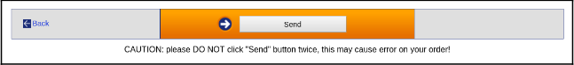
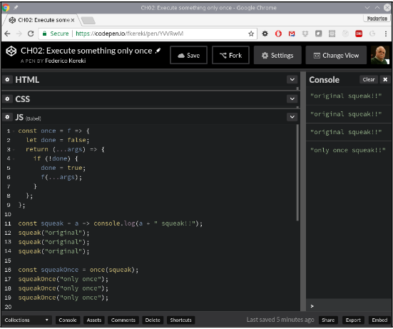
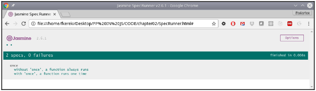

[Haz clic aquí para ir al Capítulo 1](../capitulo_1/BecomingFunctional-SeveralQuestions.md)

### Capitulo 2

### Pensando Funcionalmente - Un Primer Ejemplo

En el Capítulo 1, Convertirse en Funcional - Varias Preguntas, repasamos qué es la Programación Funcional (FP), mencionamos algunas ventajas de aplicarla y listamos algunas herramientas que necesitaríamos en JavaScript. Pero ahora dejemos la teoría atrás y comencemos considerando un problema simple y cómo resolverlo de manera funcional.

En este capítulo, haremos lo siguiente:

- Analizar un problema simple y común relacionado con el comercio electrónico.
- Considerar varias formas comunes de resolverlo, con sus defectos asociados.
- Encontrar una manera de resolver el problema viéndolo de manera funcional.
- Idear una solución de orden superior que se pueda aplicar a otros problemas.
- Ver cómo llevar a cabo pruebas unitarias para soluciones funcionales.

En capítulos futuros, volveremos a algunos de los temas mencionados aquí, por lo que no entraremos en demasiados detalles. Simplemente mostraremos cómo la FP puede ofrecer una perspectiva diferente para nuestro problema y dejaremos los detalles más profundos para después. Al trabajar en este capítulo, habrás tenido una primera visión de un problema común y una forma de resolverlo pensando de manera funcional, como preludio para el resto de este libro.

### Nuestro problema: hacer algo solo una vez

Consideremos una situación simple pero común. Has desarrollado un sitio de comercio electrónico; el usuario puede llenar su carrito de compras y, al final, debe hacer clic en un botón de Facturarme para que se le cobre con su tarjeta de crédito. Sin embargo, el usuario no debe hacer clic dos veces (o más), o será facturado varias veces.

La parte de HTML de tu aplicación podría tener algo como esto en algún lugar:

```javascript
<button id="billButton" onclick="billTheUser(some, sales, data)">
  Facturarme
</button>
```

Y, entre los scripts, tendrías algo similar al siguiente código:

```javascript
function billTheUser(some, sales, data) {
  window.alert("Facturando al usuario...");
  // en realidad, facturar al usuario
}
```

Asignar el manejador de eventos directamente en HTML, como lo hice, no es recomendado. Más bien, de manera no intrusiva, deberías asignar el manejador a través del código. ¡Así que haz lo que digo, no lo que hago!

Esta es una explicación muy básica del problema y de tu página web, pero es suficiente para nuestros propósitos. Ahora, vamos a pensar en formas de evitar los clics repetidos en ese botón. ¿Cómo podemos evitar que el usuario haga clic más de una vez? Ese es un problema interesante, con varias posibles soluciones. ¡Empecemos mirando algunas malas soluciones!

¿Cuántas formas se te ocurren para resolver nuestro problema? Repasemos varias soluciones y analicemos su calidad.

### Solución 1 – ¡esperando lo mejor!

¿Cómo podemos resolver el problema? La primera solución podría parecer una broma: no hacer nada, decirle al usuario que no haga clic dos veces, ¡y esperar lo mejor! Tu página podría verse algo así:



Esta es una forma de evadir el problema; he visto varios sitios web que simplemente advierten al usuario sobre los riesgos de hacer clic más de una vez (ver Figura 2.1) y en realidad no hacen nada para prevenir la situación: ¿el usuario fue facturado dos veces? ¡Les advertimos... es su culpa!

Tu solución podría verse simplemente así:

```javascript
<button id="billButton" onclick="billTheUser(some, sales, data)">Facturarme</button>
<b>ADVERTENCIA: ¡HAGA CLIC SOLO UNA VEZ, NO HAGA CLIC DE NUEVO!!</b>
```

Bueno, en realidad esto no es una solución; pasemos a propuestas más serias.

### Solución 2 – usando una bandera global

La solución que la mayoría de las personas probablemente pensaría primero es usar alguna variable global para registrar si el usuario ya ha hecho clic en el botón. Definirías una bandera llamada algo como clicked, inicializada en false. Cuando el usuario haga clic en el botón, si clicked es false, lo cambiarías a true y ejecutarías la función; de lo contrario, no harías nada. Aquí tienes todo esto en el siguiente código:

```javascript
let clicked = false;
.
.
.
function billTheUser(some, sales, data) {
  if (!clicked) {
    clicked = true;
    window.alert("Facturando al usuario...");
    // realmente facturar al usuario
  }
}
```

Para más razones por las cuales no usar variables globales, lee http://wiki.c2.com/?GlobalVariablesAreBad.

Esto obviamente funciona, pero tiene varios problemas que deben abordarse:

- Estás usando una variable global, y podrías cambiar su valor accidentalmente.
- Las variables globales no son una buena idea, ni en JavaScript ni en otros lenguajes.
- También debes recordar reinicializarla a false cuando el usuario comience a comprar nuevamente. Si no lo haces, el usuario no podrá hacer una segunda compra porque pagar se habrá vuelto imposible.

Tendrás dificultades para probar este código porque depende de cosas externas (es decir, la variable clicked).

Así que, esta no es una solución muy buena. ¡Sigamos pensando!

### Solución 3 – eliminando el manejador

Podemos optar por una solución lateral, y en lugar de hacer que la función evite los clics repetidos, simplemente podríamos eliminar por completo la posibilidad de hacer clic. El siguiente código hace precisamente eso; lo primero que hace billTheUser() es eliminar el manejador onclick del botón, por lo que no será posible realizar más llamadas:

```javascript
function billTheUser(some, sales, data) {
  document.getElementById("billButton").onclick = null;
  window.alert("Facturando al usuario...");
  // realmente facturar al usuario
}
```

Esta solución también tiene algunos problemas:

El código está estrechamente acoplado al botón, por lo que no podrás reutilizarlo en otros lugares.
Debes recordar restablecer el manejador, de lo contrario, el usuario no podrá realizar una segunda compra.
Las pruebas también serán más difíciles porque tendrás que proporcionar algunos elementos del DOM.
Podemos mejorar un poco esta solución y evitar acoplar la función al botón proporcionando el ID de este como un argumento adicional en la llamada. (Esta idea también se puede aplicar a algunas de las siguientes soluciones). La parte de HTML sería la siguiente, y observa el argumento adicional en billTheUser():

```javascript
<button id="billButton" onclick="billTheUser('billButton', some, sales, data)">
  Facturarme
</button>
```

También debemos cambiar la función llamada, para que utilice el valor buttonId recibido para acceder al botón correspondiente:

```javascript
function billTheUser(buttonId, some, sales, data) {
  document.getElementById(buttonId).onclick = null;
  window.alert("Facturando al usuario...");
  // realmente facturar al usuario
}
```

Esta solución es algo mejor. Pero, en esencia, todavía estamos usando un elemento global—no una variable, pero sí el valor de onclick. Así que, a pesar de la mejora, esta tampoco es una solución muy buena. ¡Sigamos avanzando!

### Solución 4 – cambiando el manejador

Una variante de la solución anterior sería no eliminar la función de clic, sino asignar una nueva en su lugar. Estamos usando funciones como objetos de primera clase aquí, cuando asignamos la función alreadyBilled() al evento de clic. La función que advierte al usuario que ya ha hecho clic podría ser algo como lo siguiente:

```javascript
function alreadyBilled() {
  window.alert(
    "Tu proceso de facturación está en curso; por favor, no hagas clic."
  );
}
```

Nuestra función billTheUser() sería entonces algo como el siguiente código—y observa cómo, en lugar de asignar null al manejador de onclick, como en la sección anterior, ahora se asigna la función alreadyBilled():

```javascript
function billTheUser(some, sales, data) {
  document.getElementById("billButton").onclick = alreadyBilled;
  window.alert("Facturando al usuario...");
  // realmente facturar al usuario
}
```

Un buen punto de esta solución es que, si el usuario hace clic una segunda vez, recibirá una advertencia de que no lo haga, pero no se le facturará nuevamente. (Desde el punto de vista de la experiencia de usuario, esto es mejor). Sin embargo, esta solución todavía tiene las mismas objeciones que la anterior (código acoplado al botón, necesidad de restablecer el manejador, y pruebas más difíciles), por lo que no la consideramos una solución realmente buena.

### Solución 5 – deshabilitar el botón

Una idea similar aquí es, en lugar de eliminar el manejador de eventos, podemos deshabilitar el botón para que el usuario no pueda hacer clic. Podrías tener una función como el siguiente código, que hace exactamente eso al establecer el atributo disabled del botón:

```javascript
function billTheUser(some, sales, data) {
  document.getElementById("billButton").setAttribute("disabled", "true");
  window.alert("Facturando al usuario...");
  // realmente facturar al usuario
}
```

Esto también funciona, pero todavía tenemos objeciones como las de las soluciones anteriores (acoplamiento del código al botón, necesidad de volver a habilitar el botón y pruebas más difíciles), por lo que tampoco nos gusta esta solución.

### Solución 6 – redefinir el manejador

Otra idea: en lugar de cambiar algo en el botón, hagamos que el manejador de eventos se cambie a sí mismo. El truco está en la segunda línea; al asignar un nuevo valor a la variable billTheUser, en realidad estamos cambiando dinámicamente lo que hace la función. La primera vez que llames a la función, hará su tarea, pero también se cambiará a sí misma para "desaparecer", dándole su nombre a una nueva función:

```javascript
function billTheUser(some, sales, data) {
  billTheUser = function () {};
  window.alert("Facturando al usuario...");
  // realmente facturar al usuario
}
```

Hay un truco especial en esta solución. Las funciones son globales, por lo que la línea billTheUser = ... realmente cambia el funcionamiento interno de la función. A partir de ese momento, billTheUser será la nueva (nula) función.

Esta solución sigue siendo difícil de probar. Aún peor, ¿cómo restaurarías la funcionalidad de billTheUser, devolviéndola a su objetivo original?

### Solución 7 – usando una bandera local

Podemos volver a la idea de usar una bandera, pero en lugar de hacerla global (que era nuestra principal objeción), podemos usar una Expresión de Función Ejecutada Inmediatamente (IIFE, por sus siglas en inglés), que veremos más adelante en el Capítulo 3: Comenzando con Funciones – Un Concepto Fundamental, y el Capítulo 11: Implementando Patrones de Diseño – De Forma Funcional. Con esto, podemos usar un closure, por lo que clicked será local a la función y no visible en ningún otro lugar:

```javascript
var billTheUser = ((clicked) => {
  return (some, sales, data) => {
    if (!clicked) {
      clicked = true;
      window.alert("Facturando al usuario...");
      // realmente facturar al usuario
    }
  };
})(false);
```

Fíjate cómo clicked obtiene su valor inicial false a partir de la llamada al final.

Esta solución sigue la línea de la solución con variable global, pero el uso de una variable privada y local es una mejora. La única desventaja que podríamos encontrar es que tendrás que rehacer cada función que necesite llamarse solo una vez para que funcione de esta manera (y, como veremos en la siguiente sección, nuestra solución funcional es similar en algunos aspectos). Bueno, no es demasiado difícil de hacer, ¡pero no olvides el consejo de No Repetirte (DRY)!

Ahora hemos explorado varias formas de resolver el problema de hacer algo solo una vez, ¡pero como hemos visto, no eran muy buenas! Pensemos en el problema de una forma funcional, y encontraremos una solución más general.

### Una solución funcional a nuestro problema

Intentemos ser más generales; después de todo, requerir que alguna función se ejecute solo una vez no es algo tan raro, ¡y puede ser necesario en otros lugares! Establezcamos algunos principios:

- La función original (la que puede ser llamada solo una vez) debe hacer lo que se espera de ella y nada más.
- No queremos modificar la función original de ninguna manera.
- Necesitamos tener una nueva función que llame a la original solo una vez.
- Queremos una solución general que podamos aplicar a cualquier número de funciones originales.

El primer principio mencionado anteriormente es el principio de responsabilidad única (el "S" de S.O.L.I.D.), que establece que cada función debe ser responsable de una sola funcionalidad. Para más información sobre S.O.L.I.D., revisa el artículo de Uncle Bob (Robert C. Martin, quien escribió los cinco principios) en http://butunclebob.com/ArticleS.UncleBob.PrinciplesOfOod.

¿Podemos hacerlo? ¡Sí, y vamos a escribir una función de orden superior, que podremos aplicar a cualquier función, para generar una nueva función que solo se ejecute una vez! ¡Veamos cómo! Introduciremos las funciones de orden superior (de las que más adelante dedicaremos el Capítulo 6: Producción de Funciones – Funciones de Orden Superior) y luego probaremos nuestra solución funcional, además de ofrecer algunas mejoras.

### Una solución de orden superior

Si no queremos modificar la función original, crearemos una función de orden superior, a la que (con inspiración) llamaremos once(). Esta función recibirá una función como parámetro y devolverá una nueva función, que solo se ejecutará una vez. (Como mencionamos antes, veremos más sobre funciones de orden superior en el Capítulo 6: Producción de Funciones – Funciones de Orden Superior; en particular, mira la sección Doing things once, revisited).

Underscore y Lodash ya tienen una función similar, invocada como \_.once(). Ramda también proporciona R.once(), y la mayoría de las bibliotecas funcionales incluyen funcionalidades similares, por lo que no tendrías que programarlo tú mismo.

Nuestra función once() puede parecer compleja al principio, pero a medida que te acostumbres a trabajar de manera funcional, te acostumbrarás a este tipo de código y te parecerá bastante comprensible:

```javascript
const once = (fn) => {
  let done = false;
  return (...args) => {
    if (!done) {
      done = true;
      fn(...args);
    }
  };
};
```

Vamos a repasar algunos de los puntos más finos de esta función:

- La primera línea muestra que once() recibe una función (fn) como su parámetro.
- Estamos definiendo una variable interna y privada done, aprovechando el closure, como en la Solución 7, previamente. Optamos por no llamarla clicked, como antes, porque no necesariamente tienes que hacer clic en un botón para llamar la función, así que elegimos un término más general. Cada vez que aplicas once() a alguna función, se creará una nueva variable done distinta y solo será accesible desde la función devuelta.
- La línea return (...args) => ... indica que once() devolverá una función, con algunos (uno o más, o posiblemente ninguno) parámetros. Ten en cuenta que estamos usando la sintaxis de spread que vimos en el Capítulo 1: Haciéndonos Funcionales – Varias Preguntas. Con versiones antiguas de JavaScript, tendrías que trabajar con el objeto arguments; consulta este enlace para más información. ¡La forma moderna de JavaScript es más simple y corta!
- Asignamos done = true antes de llamar a fn(), por si esa función lanza una excepción. Por supuesto, si no quieres deshabilitar la función a menos que haya terminado correctamente, podrías mover la asignación justo después de la llamada a fn().
- Después de hacer la asignación, finalmente llamamos a la función original. Fíjate en el uso del operador spread para pasar los parámetros que la función original fn() tenía.

Entonces, ¿cómo lo usaríamos? Ni siquiera necesitamos almacenar la nueva función generada en ningún lugar. Simplemente podemos escribir el método onclick, como se muestra a continuación:

```javascript
<button id="billButton" onclick="once(billTheUser)(some, sales, data)">
  Facturarme
</button>
```

¡Presta mucha atención a la sintaxis! Cuando el usuario hace clic en el botón, la función que se llama con los argumentos (some, sales, data) no es billTheUser(), sino el resultado de haber llamado a once() con billTheUser como parámetro. Ese resultado es el que solo puede ser llamado una vez.

Ten en cuenta que nuestra función once() usa funciones como objetos de primera clase, funciones flecha, closures y el operador spread; ¡como dijimos en el Capítulo 1: Haciéndonos Funcionales, íbamos a necesitar esas cosas, así que estamos cumpliendo nuestra palabra! Lo único que nos falta aquí de ese capítulo es la recursión, pero como cantaban los Rolling Stones, You Can't Always Get What You Want (¡No siempre puedes conseguir lo que quieres!).

Ahora tenemos una manera funcional de hacer que una función haga su trabajo solo una vez; ¿cómo lo probaríamos? Vamos a adentrarnos en ese tema ahora.

### Prueba manual de la solución

Podemos realizar una prueba simple. Vamos a escribir una función `squeak()` que, como corresponde, haga un *squeak* cuando se llame. El código es simple:

```javascript
const squeak = a => console.log(a, " squeak!!");
squeak("original"); // "original squeak!!"
squeak("original"); // "original squeak!!"
squeak("original"); // "original squeak!!"
```

Si aplicamos once() a esta función, obtenemos una nueva función que hará el squeak solo una vez. Mira la línea destacada en el siguiente código:

```javascript
const squeakOnce = once(squeak);
squeakOnce("only once"); // "only once squeak!!"
squeakOnce("only once"); // sin salida
squeakOnce("only once"); // sin salida
```

Consulta los resultados en CodePen o mira la Figura 2.2:



Los pasos anteriores nos mostraron cómo podríamos probar nuestra función once() manualmente, pero el método que usamos no es exactamente ideal. Veamos por qué, y cómo mejorar, en la siguiente sección.

### Prueba automática de la solución

Ejecutar pruebas manualmente no es ideal: se vuelve tedioso y aburrido, lo que lleva, con el tiempo, a no ejecutar más las pruebas. Vamos a hacerlo mejor y escribir algunas pruebas automáticas con Jasmine. Siguiendo las instrucciones en [https://jasmine.github.io/pages/getting_started.html](https://jasmine.github.io/pages/getting_started.html), configuré un ejecutor independiente; el código HTML requerido, utilizando Jasmine Spec Runner 2.6.1, es el siguiente:

```html
<!DOCTYPE html>
<html>
<head>
  <meta charset="utf-8">
  <title>Jasmine Spec Runner v2.6.1</title>
  <link rel="shortcut icon" type="image/png"
        href="lib/jasmine-2.6.1/jasmine_favicon.png">
  <link rel="stylesheet" href="lib/jasmine-2.6.1/jasmine.css">
  <script src="lib/jasmine-2.6.1/jasmine.js"></script>
  <script src="lib/jasmine-2.6.1/jasmine-html.js"></script>
  <script src="lib/jasmine-2.6.1/boot.js"></script>
  <script src="src/once.js"></script>
  <script src="tests/once.test.1.js"></script>
</head>
<body>
</body>
</html>
```

El archivo `src/once.js` contiene la definición de la función `once()` que acabamos de ver, y `tests/once.test.js` tiene el conjunto real de pruebas. El código para nuestras pruebas es el siguiente:

```javascript
describe("once", () => {
  beforeEach(() => {
    window.myFn = () => {};
    spyOn(window, "myFn");
  });

  it("sin 'once', una función siempre se ejecuta", () => {
    myFn();
    myFn();
    myFn();
    expect(myFn).toHaveBeenCalledTimes(3);
  });

  it("con 'once', una función se ejecuta solo una vez", () => {
    window.onceFn = once(window.myFn);
    spyOn(window, "onceFn").and.callThrough();
    onceFn();
    onceFn();
    onceFn();
    expect(onceFn).toHaveBeenCalledTimes(3);
    expect(myFn).toHaveBeenCalledTimes(1);
  });
});
```

Hay varios puntos a tener en cuenta aquí:

1. Para espiar una función, debe estar asociada a un objeto. (Alternativamente, también puedes crear un espía directamente utilizando el método `createSpy()` de Jasmine). Las funciones globales están asociadas al objeto `window`, por lo que `window.fn` es una forma de decir que `fn` es en realidad global.
   
2. Cuando espías una función, Jasmine intercepta las llamadas y registra cuántas veces se llamó la función, con qué argumentos y cuántas veces se ejecutó.

3. En el primer test, solo verificamos que si llamamos a la función varias veces, se llame ese número de veces. Esto es trivial, pero si no ocurriera, estaríamos haciendo algo realmente mal.

4. En el segundo grupo de pruebas, queremos ver que la función `once()` (en este caso `window.onceFn()`) se ejecute, pero solo una vez. Entonces, le decimos a Jasmine que espíe a `onceFn` pero deje pasar las llamadas. Cualquier llamada a `fn()` también se contará. En nuestro caso, como se esperaba, a pesar de llamar a `onceFn()` tres veces, `fn()` se ejecuta solo una vez.

Podemos ver los resultados en la Figura 2.3:



Ahora hemos visto no solo cómo probar nuestra solución funcional de manera manual, sino también de manera automática, así que hemos terminado con las pruebas. Solo nos queda considerar una solución aún mejor, también lograda de una forma funcional.

### Produciendo una solución aún mejor

En una de las soluciones anteriores, mencionamos que sería una buena idea hacer algo después del primer clic, en lugar de ignorar silenciosamente los clics del usuario. Vamos a escribir una nueva función de orden superior que tome un segundo parámetro: una función que se ejecutará cada vez a partir de la segunda llamada. Nuestra nueva función se llamará `onceAndAfter()` y se puede escribir de la siguiente manera:

```javascript
const onceAndAfter = (f, g) => {
  let done = false;
  return (...args) => {
    if (!done) {
      done = true;
      f(...args);
    } else {
      g(...args);
    }
  };
};
```

Hemos avanzado más en las funciones de orden superior; `onceAndAfter()` toma dos funciones como parámetros y produce una tercera que incluye las dos anteriores.

Podrías hacer que `onceAndAfter()` sea más potente asignando un valor predeterminado para `g`, de la siguiente manera:

```javascript
const onceAndAfter = (f, g = () => {});
```

Así, si no quisieras especificar la segunda función, todavía funcionaría correctamente porque llamaría a una función que no hace nada, en lugar de causar un error.

Podemos hacer una prueba rápida, de la misma manera que lo hicimos antes. Vamos a agregar una función `creak()` que haga un crujido a nuestra función `squeak()` anterior, y ver qué sucede si aplicamos `onceAndAfter()` a ellas. Así, obtendremos una función `makeSound()` que debería hacer `squeak()` una vez y luego `creak()`:

```javascript
const squeak = (x) => console.log(x, "squeak!!");
const creak = (x) => console.log(x, "creak!!");
const makeSound = onceAndAfter(squeak, creak);

makeSound("door"); // "door squeak!!"
makeSound("door"); // "door creak!!"
makeSound("door"); // "door creak!!"
makeSound("door"); // "door creak!!"
```

Escribir una prueba para esta nueva función no es difícil, solo un poco más largo. Tenemos que verificar qué función se llamó y cuántas veces:

```javascript
describe("onceAndAfter", () => {
  it("debería llamar a la primera función una vez, y a la otra después", () => {
    func1 = () => {};
    spyOn(window, "func1");
    func2 = () => {};
    spyOn(window, "func2");
    onceFn = onceAndAfter(func1, func2);
    onceFn();
    expect(func1).toHaveBeenCalledTimes(1);
    expect(func2).toHaveBeenCalledTimes(0);
    onceFn();
    expect(func1).toHaveBeenCalledTimes(1);
    expect(func2).toHaveBeenCalledTimes(1);
    onceFn();
    expect(func1).toHaveBeenCalledTimes(1);
    expect(func2).toHaveBeenCalledTimes(2);
    onceFn();
    expect(func1).toHaveBeenCalledTimes(1);
    expect(func2).toHaveBeenCalledTimes(3);
  });
});
```

Observa que siempre verificamos que `func1()` se llame solo una vez. De manera similar, verificamos `func2()`, cuyo contador de llamadas comienza en cero (cuando se llama `func1()`), y desde ese momento aumenta en uno con cada llamada.

### Resumen

En este capítulo, hemos visto un problema común y simple, basado en una situación de la vida real, y después de analizar varias formas típicas de resolverlo, optamos por una solución basada en el pensamiento funcional. Vimos cómo aplicar la Programación Funcional (FP) a nuestro problema y encontramos una solución más general de orden superior que podríamos aplicar a problemas similares sin necesidad de realizar más cambios en el código. 

Vimos cómo escribir pruebas unitarias para nuestro código, completando así el trabajo de desarrollo. Finalmente, produjimos una solución aún mejor (desde el punto de vista de la experiencia del usuario) y vimos cómo codificarla y cómo probarla unitariamente.

Ahora, has comenzado a comprender cómo resolver un problema de forma funcional; en el siguiente capítulo, **Capítulo 3: Empezando con las funciones – un concepto central**, profundizaremos más en las funciones, que son el núcleo de toda la Programación Funcional.

### Preguntas

## 2.1. Sin variables extra: 
Nuestra implementación funcional requería el uso de una variable extra, `done`, para marcar si la función ya se había llamado. No es que importe mucho, pero ¿podrías hacerlo sin usar ninguna variable extra? Ten en cuenta que no te estamos diciendo que no uses variables, es solo una cuestión de no agregar ninguna nueva, como `done`, ¡y solo como ejercicio!

## 2.2. Funciones alternas:
En el espíritu de nuestra función `onceAndAfter()`, ¿podrías escribir una función de orden superior `alternator()` que reciba dos funciones como argumentos y, en cada llamada, llame alternativamente una y otra? El comportamiento esperado debería ser el siguiente:

```javascript
let sayA = () => console.log("A");
let sayB = () => console.log("B");
let alt = alternator(sayA, sayB);
alt(); // A
alt(); // B
alt(); // A
alt(); // B
alt(); // A
alt(); // B
```

## 2.3. ¡Todo tiene un límite! 
Como una extensión de `once()`, ¿podrías escribir una función de orden superior, `thisManyTimes(fn, n)`, que permita llamar a la función `fn()` hasta `n` veces, pero luego no haga nada? Para dar un ejemplo, `once(fn)` y `thisManyTimes(fn, 1)` producirían funciones que se comportan de la misma manera.
