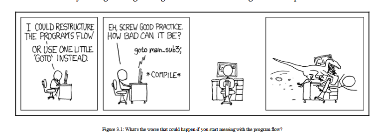

[Haz clic aquí para ir al Capítulo 2](./../capitulo_2/ThinkingFunctionally-AFirstExample.md)

# Empezando con Funciones - Un Concepto Central Capítulo 3


El punto que queremos destacar es que una función puede ser asignada a una variable y también puede ser reasignada si se desea. De manera similar, podemos definir funciones en el momento en que se necesitan. Incluso podemos hacer esto sin nombrarlas: al igual que con las expresiones comunes, si se usan solo una vez, entonces no es necesario nombrarlas ni almacenarlas en una variable.

## Un reducer de React-Redux

Podemos ver otro ejemplo que implica la asignación de funciones. Como mencionamos anteriormente en este capítulo, React-Redux funciona enviando acciones que son procesadas por un reducer. Por lo general, el reducer incluye código con un `switch`:

```javascript
function doAction(state = initialState, action) {
  let newState = {};
  switch (action.type) {
    case "CREATE":
      // actualizar el estado, generando newState,
      // dependiendo de los datos de la acción
      // para crear un nuevo elemento
      return newState;
    case "DELETE":
      // actualizar el estado, generando newState,
      // después de eliminar un elemento
      return newState;
    case "UPDATE":
      // actualizar un elemento,
      // y generar un estado actualizado
      return newState;
    default:
      return state;
  }
}
```

Proporcionar `initialState` como un valor predeterminado para `state` es una forma simple de inicializar el estado global la primera vez. No prestes atención a ese `default`; no es relevante para nuestro ejemplo, pero lo incluí solo por completitud.

Al aprovechar la posibilidad de almacenar funciones, podemos construir una tabla de despacho y simplificar el código anterior. Primero, inicializamos un objeto con el código de las funciones para cada tipo de acción.

```javascript
const dispatchTable = {
  CREATE: (state, action) => {
    // actualizar el estado, generando newState,
    // dependiendo de los datos de la acción
    // para crear un nuevo elemento
    return newState;
  },
  DELETE: (state, action) => {
    // actualizar el estado, generando newState,
    // después de eliminar un elemento
    return newState;
  },
  UPDATE: (state, action) => {
    // actualizar un elemento,
    // y generar un estado actualizado
    return newState;
  }
};
```

Almacenamos las diferentes funciones que procesan cada tipo de acción como atributos en un objeto que funcionará como una tabla de despacho. Este objeto se crea solo una vez y es constante durante la ejecución de la aplicación. Con él, ahora podemos reescribir el código de procesamiento de acciones en una sola línea de código:

```javascript
function doAction2(state = initialState, action) {
  return dispatchTable[action.type]
    ? dispatchTable[action.type](state, action)
    : state;
}
```

Analicémoslo: dada la acción, si `action.type` coincide con un atributo en el objeto de despacho, ejecutamos la función correspondiente tomada del objeto donde se almacenó. Si no hay coincidencia, simplemente devolvemos el estado actual como requiere Redux. Este tipo de código no sería posible si no pudiéramos manejar funciones (almacenarlas y recordarlas) como objetos de primera clase.

[ 57 ]

## Un error innecesario

Sin embargo, hay un error común (aunque de hecho, inofensivo) que suele cometerse. A menudo se ve código como este:

```javascript
fetch("some/remote/url").then(function(data) {
  processResult(data);
});
```

¿Qué hace este código? La idea es que se obtiene una URL remota, y cuando llegan los datos, se llama a una función, y esta función a su vez llama a `processResult` con `data` como argumento. Es decir, en la parte `then()`, queremos una función que, dado `data`, calcule `processResult(data)`. Pero, ¿no tenemos ya tal función?

Un poco de teoría: en términos de cálculo lambda, estamos reemplazando `λx.func x` con simplemente `func`. Esto se llama una conversión eta, o más específicamente, una reducción eta. (Si lo hicieras al revés, sería una abstracción eta). En nuestro caso, podría considerarse una (¡muy, muy pequeña!) optimización, pero su principal ventaja es un código más corto y compacto.

Básicamente, hay una regla que puedes aplicar cada vez que veas algo como lo siguiente:

```javascript
function someFunction(someData) {
  return someOtherFunction(someData);
}
```

Esta regla establece que puedes reemplazar el código que se asemeja al anterior con solo `someOtherFunction`. Entonces, en nuestro ejemplo, podemos escribir directamente lo siguiente:

```javascript
fetch("some/remote/url").then(processResult);
```

Este código es exactamente equivalente al método anterior que vimos (aunque es infinitesimalmente más rápido, ya que evitas una llamada a función), pero ¿es más simple de entender? Este estilo de programación se llama estilo pointfree o estilo tácito, y su principal característica es que nunca especificas los argumentos para cada aplicación de función. Una ventaja de esta forma de codificar es que ayuda al escritor (y a los futuros lectores del código) a pensar en las funciones mismas y sus significados en lugar de trabajar a un nivel bajo, pasando datos y trabajando con ellos. En la versión más corta del código, no hay detalles extraños o irrelevantes: si entiendes lo que hace la función llamada, entonces entiendes el significado de la pieza completa de código. En nuestro texto, a menudo (pero no necesariamente siempre) trabajaremos de esta manera.

[ 58 ]

Los usuarios de Unix/Linux ya pueden estar acostumbrados a este estilo, porque trabajan de manera similar cuando usan tuberías para pasar el resultado de un comando como entrada a otro. Cuando escribes algo como `ls|grep doc|sort`, la salida de `ls` es la entrada de `grep`, y la salida de este último es la entrada de `sort`, pero los argumentos de entrada no se escriben en ningún lugar; están implícitos. Volveremos a esto en la sección Estilo Pointfree del Capítulo 8, Conectando Funciones - Tuberías y Composición.

## Trabajando con métodos

Sin embargo, hay un caso del que debes estar consciente: ¿qué sucede si estás llamando a un método de un objeto? Mira el siguiente código:

```javascript
fetch("some/remote/url").then(function(data) {
  myObject.store(data);
});
```

Si tu código original hubiera sido algo como el anterior, entonces el código transformado aparentemente obvio fallaría:

```javascript
fetch("some/remote/url").then(myObject.store);
```

¿Por qué? La razón es que en el código original, el método llamado está vinculado a un objeto (`myObject`), pero en el código modificado, no está vinculado y es solo una función libre. Podemos arreglarlo de manera simple usando `bind()`, de la siguiente manera:

```javascript
fetch("some/remote/url").then(myObject.store.bind(myObject));
```

Esta es una solución general. Cuando se trata de un método, no puedes simplemente asignarlo; debes usar `bind()` para que el contexto correcto esté disponible. Mira el siguiente código:

```javascript
function doSomeMethod(someData) {
  return someObject.someMethod(someData);
}
```

Siguiendo esta regla, el código como el anterior debería convertirse en lo siguiente:

```javascript
const doSomeMethod = someObject.someMethod.bind(someObject);
```

Lee más sobre `bind()` en https://developer.mozilla.org/en/docs/Web/JavaScript/Reference/Global_objects/Function/bind.

[ 59 ]

Esto parece bastante incómodo y no muy elegante, pero es necesario para que el método esté asociado con el objeto correcto. Veremos una aplicación de esto cuando promisifiquemos funciones en el Capítulo 6, Produciendo Funciones - Funciones de Orden Superior. Incluso si este código no es tan agradable a la vista, cada vez que tengas que trabajar con objetos (y recuerda, no dijimos que intentaríamos apuntar a un código completamente FP, y dijimos que aceptaríamos otras construcciones si facilitaban las cosas), tendrás que recordar vincular métodos antes de pasarlos como objetos de primera clase en estilo pointfree.

## Usando funciones de manera FP

Hay varios patrones de codificación comunes que en realidad aprovechan el estilo FP, incluso si no eras consciente de ello. En esta sección, los revisaremos y veremos los aspectos funcionales del código para que puedas acostumbrarte más a este estilo de codificación.

Luego, veremos en detalle el uso de funciones de manera FP considerando varias técnicas FP, como las siguientes:

- Inyección, que es necesaria para ordenar diferentes estrategias, así como otros usos
- Callbacks y promesas, introduciendo el estilo de paso de continuaciones
- Polyfilling y stubbing
- Esquemas de invocación inmediata

### Inyección - ordenándolo

El primer ejemplo de pasar funciones como parámetros es proporcionado por el método `Array.prototype.sort()`. Si tienes un array de cadenas y quieres ordenarlo, puedes simplemente usar el método `sort()`. Por ejemplo, para ordenar alfabéticamente un array con los colores del arcoíris, escribiríamos algo como lo siguiente:

```javascript
var colors = [
  "violet",
  "indigo",
  "blue",
  "green",
  "yellow",
  "orange",
  "red"
];
colors.sort();
console.log(colors);
// ["blue", "green", "indigo", "orange", "red", "violet", "yellow"]
```

[ 60 ]

Nota que no tuvimos que proporcionar ningún parámetro a la llamada `sort()`, pero el array se ordenó perfectamente bien. Por defecto, este método ordena las cadenas según su representación interna ASCII. Entonces, si usas este método para ordenar un array de números, fallará, ya que decidirá que 20 debe estar entre 100 y 3, porque 100 precede a 20 (tomados como cadenas) y este último precede a 3, ¡así que esto necesita arreglarse! El siguiente código muestra el problema:

```javascript
var someNumbers = [3, 20, 100];
someNumbers.sort();
console.log(someNumbers);
// [100, 20, 3]
```

Pero olvidémonos de los números por un momento y sigamos ordenando cadenas. Queremos preguntarnos qué pasaría si quisiéramos ordenar algunas palabras en español (palabras) pero siguiendo las reglas de localización apropiadas. Estaríamos ordenando cadenas, pero los resultados no serían correctos:

```javascript
var palabras = ["ñandú", "oasis", "mano", "natural", "mítico", "musical"];
palabras.sort();
console.log(palabras);
// ["mano", "musical", "mítico", "natural", "oasis", "ñandú"] -- ¡resultado incorrecto!
```

Para los aficionados al idioma o la biología, "ñandú" en inglés es rhea, un ave corredora algo similar a los avestruces. ¡No hay muchas palabras en español que comiencen con ñ, y resulta que tenemos estas aves en mi país, Uruguay, así que esa es la razón de la palabra extraña!

¡Ups! En español, ñ viene entre n y o, pero "ñandú" se ordenó al final. Además, "mítico" (en inglés, mythical; nota la í acentuada) debería aparecer entre "mano" y "musical" porque la tilde debería ignorarse. La forma apropiada de resolver esto es proporcionando una función de comparación a `sort()`. En este caso, podemos usar el método `localeCompare()` de la siguiente manera:

```javascript
palabras.sort((a, b) => a.localeCompare(b, "es"));
console.log(palabras);
// ["mano", "mítico", "musical", "natural", "ñandú", "oasis"]
```

La llamada `a.localeCompare(b,"es")` compara las cadenas `a` y `b` y devuelve un valor negativo si `a` precede a `b`, un valor positivo si `a` sigue a `b`, y 0 si `a` y `b` son iguales, pero según las reglas de ordenación en español ("es").

[ 61 ]

¡Ahora las cosas están bien! Y el código podría hacerse más claro introduciendo una nueva función, `spanishComparison()`, para realizar la comparación de cadenas requerida:

```javascript
const spanishComparison = (a, b) => a.localeCompare(b, "es");
palabras.sort(spanishComparison);
// ordena el array palabras según las reglas del español:
// ["mano", "mítico", "musical", "natural", "ñandú", "oasis"]
```

En los próximos capítulos, discutiremos cómo FP te permite escribir código de una manera más declarativa, produciendo un código más comprensible, y este tipo de pequeño cambio ayuda: cuando los lectores del código llegan al `sort`, deducirán inmediatamente lo que se está haciendo, incluso si el comentario no estuviera presente.

Esta forma de cambiar la forma en que funciona la función `sort()` inyectando diferentes funciones de comparación es en realidad un caso del patrón de diseño de estrategia. Aprenderemos más sobre esto en el Capítulo 11, Implementando Patrones de Diseño - La Manera Funcional.

Proporcionar una función de ordenación como parámetro (¡de una manera muy FP!) también puede ayudar con varios otros problemas, como los siguientes:

- `sort()` solo funciona con cadenas. Si quieres ordenar números (como intentamos hacer anteriormente), debes proporcionar una función que compare numéricamente. Por ejemplo, escribirías algo como `myNumbers.sort((a,b) => a-b)`.
- Si quieres ordenar objetos por un atributo dado, usarás una función que compare con él. Por ejemplo, podrías ordenar personas por edad con algo como `myPeople.sort((a,b) => a.age - b.age)`.

Para más información sobre las posibilidades de `localeCompare()`, consulta https://developer.mozilla.org/en/docs/Web/JavaScript/Reference/Global_Objects/String/localeCompare. Puedes especificar qué reglas de localización aplicar, en qué orden colocar letras mayúsculas/minúsculas, si ignorar la puntuación y mucho más. Pero ten cuidado: no todos los navegadores pueden admitir los parámetros adicionales requeridos.

Este es un ejemplo simple que probablemente has usado antes, pero es un patrón FP, después de todo. Pasemos a un uso aún más común de funciones como parámetros cuando realizas llamadas Ajax.

[ 62 ]

## Callbacks, promesas y continuaciones

Probablemente el ejemplo más utilizado de funciones pasadas como objetos de primera clase tiene que ver con callbacks y promesas. En Node, leer un archivo se logra de manera asíncrona con algo como el siguiente código:

```javascript
const fs = require("fs");
fs.readFile("someFile.txt", (err, data) => {
  if (err) {
    console.error(err); // o lanzar un error, o manejar el problema de otra manera
  } else {
    console.log(data.toString()); // hacer algo con los datos
  }
});
```

La función `readFile()` requiere un callback, en este ejemplo una función anónima, que se llamará cuando se complete la operación de lectura del archivo.

Una mejor manera es usar promesas; lee más en https://developer.mozilla.org/en-US/docs/Web/JavaScript/Reference/Global_Objects/Promise. Con esto, al realizar una llamada a un servicio web Ajax usando la función más moderna `fetch()`, podrías escribir algo como lo siguiente:

```javascript
fetch("some/remote/url")
  .then(data => {
    // Hacer algún trabajo con los datos devueltos
  })
  .catch(error => {
    // Procesar todos los errores aquí
  });
```

Nota que si hubieras definido las funciones apropiadas `processData(data)` y `processError(error)`, el código podría haberse acortado a `fetch("some/remote/url").then(processData).catch(processError)` siguiendo las líneas que vimos anteriormente.

Finalmente, también deberías considerar usar `async/await`; lee más sobre esto en https://developer.mozilla.org/en-US/docs/Web/JavaScript/Reference/Statements/async_function y https://developer.mozilla.org/en-US/docs/Web/JavaScript/Reference/Operators/await.


<div align="center">
  
</div>


# Empezando con Funciones - Un Concepto Central Capítulo 3


No estás limitado a pasar una única continuación. Al igual que con las promesas, puedes proporcionar dos o más callbacks alternativos. Y esto, por cierto, puede proporcionar una solución al problema de cómo trabajarías con excepciones. Si simplemente permitiéramos que una función lance un error, sería un retorno implícito al llamador, y no queremos esto. La solución a esto es proporcionar un callback alternativo (es decir, una continuación diferente) que se usará cada vez que se lance una excepción (en el Capítulo 12, *Construyendo Mejores Contenedores - Tipos de Datos Funcionales*, encontraremos otra solución usando mónadas):

```javascript
function doSomething(a, b, c, normalContinuation, errorContinuation) {
  let r = 0;
  // ... hacer algunos cálculos que involucren a, b y c,
  // y almacenar el resultado en r
  // si ocurre un error, invocar:
  // errorContinuation("descripción del error")
  // de lo contrario, invocar:
  // normalContinuation(r)
}
```

El uso de CPS (Continuation-Passing Style) incluso puede permitirte ir más allá de las estructuras de control que JavaScript proporciona, pero eso estaría más allá de los objetivos de este libro, así que te dejaré investigar eso por tu cuenta.

## Polyfills

Poder asignar funciones dinámicamente (de la misma manera que puedes asignar diferentes valores a una variable) también te permite trabajar de manera más eficiente al definir polyfills.

### Detección de Ajax

Retrocedamos un poco en el tiempo cuando Ajax comenzó a aparecer. Dado que diferentes navegadores implementaban llamadas Ajax de distintas maneras, siempre tenías que codificar alrededor de estas diferencias. El siguiente código muestra cómo implementarías una llamada Ajax probando varias condiciones diferentes:

```javascript
function getAjax() {
  let ajax = null;
  if (window.XMLHttpRequest) {
    // ¿Navegador moderno? Usa XMLHttpRequest
    ajax = new XMLHttpRequest();
  } else if (window.ActiveXObject) {
    // de lo contrario, usa ActiveX para IE5 e IE6
    ajax = new ActiveXObject("Microsoft.XMLHTTP");
  } else {
    throw new Error("¡No hay soporte para Ajax!");
  }
  return ajax;
}
```

Esto funcionó, pero implicaba que tendrías que rehacer la verificación de Ajax para cada llamada, aunque los resultados de la prueba nunca cambiarían. Hay una manera más eficiente de hacer esto, y tiene que ver con el uso de funciones como objetos de primera clase. Podríamos definir dos funciones diferentes, probar la condición solo una vez y luego asignar la función correcta para usarla más tarde; estudia el siguiente código para ver una alternativa:

```javascript
(function initializeGetAjax() {
  let myAjax = null;
  if (window.XMLHttpRequest) {
    // ¿Navegadores modernos? Usa XMLHttpRequest
    myAjax = function() {
      return new XMLHttpRequest();
    };
  } else if (window.ActiveXObject) {
    // Es ActiveX para IE5 e IE6
    myAjax = function() {
      new ActiveXObject("Microsoft.XMLHTTP");
    };
  } else {
    myAjax = function() {
      throw new Error("¡No hay soporte para Ajax!");
    };
  }
  window.getAjax = myAjax;
})();
```

Este fragmento de código muestra dos conceptos importantes. Primero, podemos asignar una función dinámicamente: cuando este código se ejecuta, `window.getAjax` (es decir, la variable global `getAjax`) obtendrá uno de los tres valores posibles según el navegador actual. Cuando más tarde llames a `getAjax()` en tu código, la función correcta se ejecutará sin que necesites hacer más pruebas de detección del navegador.

La segunda idea interesante es que definimos la función `initializeGetAjax` y la ejecutamos inmediatamente; este patrón se llama **expresión de función inmediatamente invocada** (IIFE). La función se ejecuta, pero se limpia después de sí misma, porque todas sus variables son locales y ni siquiera existirán después de que la función se ejecute. Aprenderemos más sobre esto más adelante.

# Empezando con Funciones - Un Concepto Central Capítulo 3


## Añadiendo funciones faltantes

Esta idea de definir una función sobre la marcha también nos permite escribir **polyfills** que proporcionan funciones que de otro modo faltarían. Por ejemplo, supongamos que tenemos algún código como el siguiente:

```javascript
if (currentName.indexOf("Mr.") !== -1) {
  // es un hombre
  ...
}
```

En lugar de esto, podrías preferir usar la forma más nueva y clara, y simplemente escribir lo siguiente:

```javascript
if (currentName.includes("Mr.")) {
  // es un hombre
  ...
}
```

¿Qué sucede si tu navegador no proporciona `.includes()`? Una vez más, podemos definir la función apropiada sobre la marcha, pero solo si es necesario. Si `.includes()` está disponible, no necesitas hacer nada, pero si falta, necesitas definir un polyfill que proporcionará el mismo funcionamiento. El siguiente código muestra un ejemplo de dicho polyfill:

Puedes encontrar polyfills para muchas características modernas de JavaScript en el sitio de desarrolladores de Mozilla. Por ejemplo, el polyfill que usamos para `includes` fue tomado directamente de [https://developer.mozilla.org/en/docs/Web/JavaScript/Reference/Global_Objects/String/includes](https://developer.mozilla.org/en/docs/Web/JavaScript/Reference/Global_Objects/String/includes).

```javascript
if (!String.prototype.includes) {
  String.prototype.includes = function(search, start) {
    "use strict";
    if (typeof start !== "number") {
      start = 0;
    }
    if (start + search.length > this.length) {
      return false;
    } else {
      return this.indexOf(search, start) !== -1;
    }
  };
}
```

Cuando este código se ejecuta, verifica si el prototipo de `String` ya tiene el método `includes`. Si no lo tiene, le asigna una función que hace el mismo trabajo, por lo que a partir de ese momento podrás usar `.includes()` sin preocupaciones adicionales. Por cierto, hay otras formas de definir un polyfill: consulta la respuesta a la pregunta 3.5 para una alternativa.

Modificar directamente el prototipo de un tipo estándar generalmente es mal visto, porque en esencia es equivalente a usar una variable global y, por lo tanto, es propenso a errores; sin embargo, este caso (escribir un polyfill para una función bien establecida y conocida) es bastante poco probable que provoque conflictos.

Finalmente, si pensaste que el ejemplo de Ajax mostrado anteriormente era anticuado, considera esto: si quieres usar la forma más moderna de llamar a servicios con `fetch()`, también encontrarás que no todos los navegadores modernos lo soportan (verifica [http://caniuse.com/#search=fetch](http://caniuse.com/#search=fetch) para confirmar esto), por lo que tendrás que usar un polyfill, como el que se encuentra en [https://github.com/github/fetch](https://github.com/github/fetch). Estudia el código y verás que básicamente usa el mismo método descrito anteriormente para ver si se necesita un polyfill y crearlo.

## Stubbing

Aquí veremos un caso de uso que es similar en algunos aspectos a usar un polyfill: hacer que una función haga un trabajo diferente dependiendo del entorno. La idea es realizar **stubbing**, una idea que proviene de las pruebas y que implica reemplazar una función con otra que hace un trabajo más simple, en lugar de hacer el trabajo real.

El stubbing se usa comúnmente con funciones de registro. Es posible que desees que la aplicación realice un registro detallado cuando está en desarrollo, pero que no diga ni una palabra cuando está en producción. Una solución común sería escribir algo como lo siguiente:

```javascript
let myLog = someText => {
  if (DEVELOPMENT) {
    console.log(someText); // o alguna otra forma de registro
  } else {
    // no hacer nada
  }
}
```

Esto funciona, pero como en el ejemplo de la detección de Ajax, hace más trabajo del necesario porque verifica si la aplicación está en desarrollo cada vez.

[ 68 ]

Podríamos simplificar el código (¡y obtener una ganancia de rendimiento realmente pequeña!) si hacemos stubbing de la función de registro para que en realidad no registre nada; una implementación fácil es la siguiente:

```javascript
let myLog;
if (DEVELOPMENT) {
  myLog = someText => console.log(someText);
} else {
  myLog = someText => {};
}
```

Incluso podemos hacerlo mejor con el operador ternario:

```javascript
const myLog = DEVELOPMENT
  ? someText => console.log(someText)
  : someText => {};
```

Esto es un poco más críptico, pero lo prefiero porque usa un `const`, que no se puede modificar.

Dado que JavaScript nos permite llamar a funciones con más parámetros que argumentos, y dado que no estamos haciendo nada en `myLog()` cuando no estamos en desarrollo, también podríamos haber escrito `() => {}` y habría funcionado bien. Sin embargo, prefiero mantener la misma firma, y es por eso que especifiqué el argumento `someText`, incluso si no se usaría. ¡Tú decides!

Notarás que estamos usando el concepto de funciones como objetos de primera clase una y otra vez; ¡mira todos los ejemplos de código y lo verás!

## Invocación inmediata

Hay otro uso común de las funciones, generalmente visto en bibliotecas y frameworks populares, que te permite traer algunas ventajas de modularidad de otros lenguajes a JavaScript (¡incluso en versiones más antiguas!). La forma habitual de escribir esto es algo como lo siguiente:

```javascript
(function() {
  // hacer algo...
})();
```

Otro estilo equivalente es `(function(){ ... }())`—nota la diferente ubicación de los paréntesis para la llamada a la función. Ambos estilos tienen sus seguidores; elige el que más te guste, pero síguelo consistentemente.

[ 69 ]

También puedes tener el mismo estilo, pero pasar algunos argumentos a la función que se usarán como valores iniciales para sus parámetros:

```javascript
(function(a, b) {
  // hacer algo, usando los
  // argumentos recibidos para a y b...
})(some, values);
```

Finalmente, también podrías devolver algo desde la función:

```javascript
let x = (function(a, b) {
  // ...devolver un objeto o función
})(some, values);
```

Como mencionamos anteriormente, el patrón en sí se llama **IIFE** (pronunciado "iffy"). El nombre es fácil de entender: estás definiendo una función y llamándola de inmediato, por lo que se ejecuta en el acto. ¿Por qué harías esto, en lugar de simplemente escribir el código en línea? La razón tiene que ver con los ámbitos.

Nota los paréntesis alrededor de la función. Estos ayudan al analizador a entender que estamos escribiendo una expresión. Si omitieras el primer conjunto de paréntesis, JavaScript pensaría que estás escribiendo una declaración de función en lugar de una invocación. Los paréntesis también sirven como una nota visual, por lo que los lectores de tu código reconocerán inmediatamente la IIFE.

Si defines cualquier variable o función dentro de la IIFE, debido a cómo JavaScript define el alcance de las funciones, esas definiciones serán internas, y ninguna otra parte de tu código podrá acceder a ellas. Imagina que querías escribir alguna inicialización complicada, como la siguiente:

```javascript
function ready() { ... }
function set() { ... }
function go() { ... }
// inicializar cosas llamando a ready(),
// set() y go() apropiadamente
```

¿Qué podría salir mal? El problema radica en el hecho de que podrías (por accidente) tener una función con el mismo nombre que cualquiera de las tres aquí, y el hoisting implicaría que se llamaría a la última función:

```javascript
function ready() {
  console.log("ready");
}
function set() {
  console.log("set");
}
function go() {
  console.log("go");
}
ready();
set();
go();
function set() {
  console.log("INESPERADO...");
}
// "ready"
// "INESPERADO"
// "go"
```

¡Ups! Si hubieras usado una IIFE, el problema no habría ocurrido. Además, las tres funciones internas ni siquieran serían visibles para el resto del código, lo que ayuda a mantener el espacio de nombres global menos contaminado. El siguiente código muestra un patrón muy común para esto:

```javascript
(function() {
  function ready() {
    console.log("ready");
  }
  function set() {
    console.log("set");
  }
  function go() {
    console.log("go");
  }
  ready();
  set();
  go();
})();
function set() {
  console.log("INESPERADO...");
}
```

# Empezando con Funciones - Un Concepto Central Capítulo 3


¡Ups! Si hubieras usado una IIFE, el problema no habría ocurrido. Además, las tres funciones internas ni siquiera serían visibles para el resto del código, lo que ayuda a mantener el espacio de nombres global menos contaminado. El siguiente código muestra un patrón muy común para esto:

```javascript
(function() {
  function ready() {
    console.log("ready");
  }
  function set() {
    console.log("set");
  }
  function go() {
    console.log("go");
  }
  ready();
  set();
  go();
})();
function set() {
  console.log("INESPERADO...");
}
// "ready"
// "set"
// "go"
```

Para ver un ejemplo que involucra valores devueltos, podríamos revisar el ejemplo del Capítulo 1, *Volviéndose Funcional - Varias Preguntas*, y escribir lo siguiente, lo que crearía un solo contador:

```javascript
const myCounter = (function() {
  let count = 0;
  return function() {
    count++;
    return count;
  };
})();
```

Luego, cada llamada a `myCounter()` devolvería un conteo incrementado, pero no hay posibilidad de que ninguna otra parte de tu código sobrescriba la variable interna `count` porque solo es accesible dentro de la función devuelta.

## Resumen

En este capítulo, repasamos varias formas de definir funciones en JavaScript, centrándonos principalmente en las funciones de flecha, que tienen varias ventajas sobre las funciones estándar, incluida ser más concisas. Aprendimos sobre el concepto de currying (que revisaremos más adelante), consideramos algunos aspectos de las funciones como objetos de primera clase y, finalmente, consideramos varias técnicas que resultan ser completamente FP en concepto. ¡Ten la seguridad de que usaremos todo en este capítulo como los bloques de construcción para técnicas más avanzadas en el resto del libro; solo espera y verás!

En el Capítulo 4, *Comportándose Correctamente - Funciones Puras*, profundizaremos aún más en las funciones y aprenderemos sobre el concepto de funciones puras, lo que nos llevará a un estilo de programación aún mejor.

## Preguntas

### 3.1 ¿Objeto no inicializado?

Los programadores de React-Redux suelen codificar creadores de acciones para simplificar la creación de acciones que luego serán procesadas por un reducer. Las acciones son objetos, que deben incluir un atributo `type` que se usa para determinar qué tipo de acción estás despachando. El siguiente código supuestamente hace esto, pero ¿puedes explicar los resultados inesperados?

```javascript
const simpleAction = t => {
  type: t;
};
console.log(simpleAction("INITIALIZE"));
// undefined
```

### 3.2 ¿Se permiten flechas?

¿Sería todo igual si definieras `listArguments()` y `listArguments2()` de la sección *Trabajando con argumentos* usando funciones de flecha en lugar de la forma en que lo hicimos, con la palabra clave `function`?

### 3.3 Una sola línea

Algunos programadores, particularmente ahorrativos con las líneas de código, sugirieron reescribir `doAction2()` como una sola línea, ¡aunque no se puede decir esto por el formato! ¿Qué piensas: es correcto o no?

```javascript
const doAction3 = (state = initialState, action) =>
  (dispatchTable[action.type] &&
    dispatchTable[action.type](state, action)) ||
  state;
```

### 3.4 ¡Encuentra el error!

Un programador, trabajando con una tienda global para el estado (similar en concepto a las de Redux, Mobx, Vuex y otras usadas por diferentes frameworks web), quería registrar (con fines de depuración) todas las llamadas al método `set()` de la tienda. Después de crear el nuevo objeto de la tienda, escribió lo siguiente para que los argumentos de `store.set()` se registraran antes de ser procesados. Desafortunadamente, el código no funcionó como se esperaba. ¿Cuál es el problema? ¿Puedes encontrar el error?

```javascript
window.store = new Store();
const oldSet = window.store.set;
window.store.set = (...data) => (console.log(...data), oldSet(...data));
```

### 3.5 Enlace sin `bind`

Supongamos que `bind()` no estuviera disponible; ¿cómo podrías hacer un polyfill para él?


