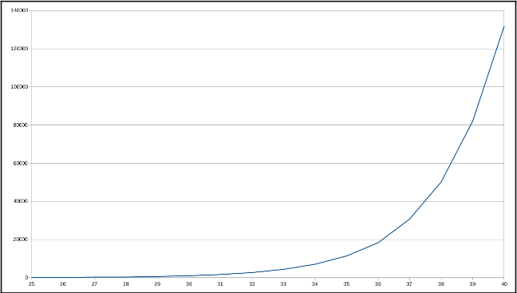
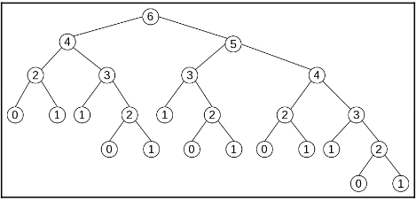
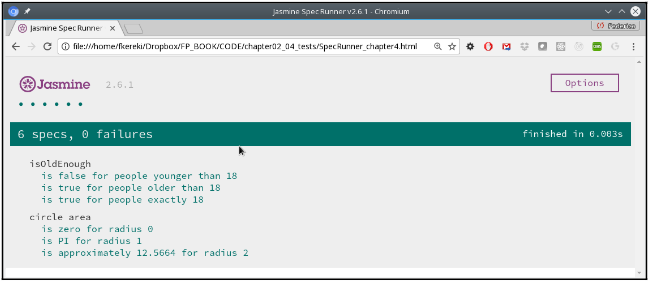

[Haz clic aquí para ir al Capítulo 3](./../capitulo_3/StartingOutwithFunctions-ACoreConcept.md)

# Behaving Properly - Pure Functions (Capítulo 4)

En el capítulo 3, _Comenzando con Funciones – Un Concepto Fundamental_, consideramos las funciones como los elementos clave en la Programación Funcional (FP), profundizamos en las funciones de flecha e introdujimos algunos conceptos, como inyección, callbacks, polyfilling y stubbing. En este capítulo, tendremos la oportunidad de revisar o aplicar algunas de esas ideas. También haremos lo siguiente:

- Considerar la noción de pureza y por qué deberíamos preocuparnos por las funciones puras, ¡y también por las impuras!
- Examinar el concepto de transparencia referencial.
- Reconocer los problemas implicados por los efectos secundarios.
- Mostrar algunas ventajas de las funciones puras.
- Describir las principales razones detrás de las funciones impuras.
- Encontrar formas de minimizar el número de funciones impuras.
- Enfocarnos en maneras de probar tanto funciones puras como impuras.

## Funciones Puras

Las funciones puras se comportan de la misma manera que las funciones matemáticas y proporcionan diversos beneficios. Una función es pura si cumple con dos condiciones:

1. **Dado los mismos argumentos, la función siempre calcula y devuelve el mismo resultado:** Esto debe ser cierto sin importar cuántas veces se invoque o bajo qué condiciones se llame. Este resultado no puede depender de ninguna información o estado externo, el cual podría cambiar durante la ejecución del programa y causar que la función devuelva un valor diferente. Tampoco puede depender de resultados de E/S (entrada/salida), números aleatorios, alguna otra variable externa, o un valor que no se pueda controlar directamente.

2. **Cuando calcula su resultado, la función no causa efectos secundarios observables:** Esto incluye salida a dispositivos de E/S, la mutación de objetos, cambios en el estado del programa fuera de la función, entre otros.

Si lo deseas, puedes decir que las funciones puras no dependen de (y no modifican) nada fuera de su alcance y siempre devuelven el mismo resultado para los mismos argumentos de entrada.

Otra palabra que se usa en este contexto es **idempotencia**, pero no es exactamente lo mismo. Una función idempotente puede ser llamada tantas veces como se desee y siempre producirá el mismo resultado; sin embargo, esto no implica que la función esté libre de efectos secundarios. La idempotencia generalmente se menciona en el contexto de servicios RESTful.

Veamos un ejemplo simple que muestra la diferencia entre pureza e idempotencia. Una llamada `PUT` causaría que un registro en la base de datos sea actualizado (un efecto secundario), pero si repites la llamada, el elemento no será modificado nuevamente, por lo que el estado global de la base de datos no cambiará más.

También podríamos invocar un principio de diseño de software y recordarnos a nosotros mismos que una función debe hacer una sola cosa, solo una cosa y nada más que esa cosa. Si una función hace algo más y tiene alguna funcionalidad oculta, esa dependencia en el estado significará que no podremos predecir la salida de la función, lo que nos dificultará las cosas como desarrolladores.

Vamos a explorar estas condiciones con más detalle.

# Transparencia Referencial

En matemáticas, la **transparencia referencial** es la propiedad que te permite reemplazar una expresión por su valor sin cambiar los resultados de lo que estés haciendo.

El contrapunto de la transparencia referencial es, apropiadamente, la **opacidad referencial**. Una función referencialmente opaca no puede garantizar que siempre producirá el mismo resultado, incluso cuando se le llamen los mismos argumentos.

Para dar un ejemplo sencillo, consideremos lo que sucede con un compilador optimizador que realiza una **reducción de constantes**. Supongamos que tienes una sentencia como esta:

```javascript
const x = 1 + 2 * 3;
```

El compilador podría optimizar el código de la siguiente manera, al notar que `2 * 3` es un valor constante:

```javascript
const x = 1 + 6;
```

¡Incluso mejor! Una nueva ronda de optimización podría evitar la suma por completo:

```javascript
const x = 7;
```

Para ahorrar tiempo de ejecución, el compilador aprovecha el hecho de que todas las expresiones matemáticas y funciones son (por definición) **referencialmente transparentes**. Por otro lado, si el compilador no puede predecir la salida de una expresión dada, no podrá optimizar el código de ninguna manera y el cálculo tendrá que hacerse en tiempo de ejecución.

En el cálculo lambda, si reemplazas el valor de una expresión que involucra una función por el valor calculado para la función, entonces esa operación se llama una **reducción β (beta)**. Ten en cuenta que solo puedes hacer esto de manera segura con funciones referencialmente transparentes.

Todas las expresiones aritméticas (que involucran tanto operadores matemáticos como funciones) son referencialmente transparentes: `22 * 9` siempre puede ser reemplazado por `198`. Las expresiones que involucran E/S (entrada/salida) no son transparentes, dado que sus resultados no pueden conocerse hasta que se ejecuten. Por la misma razón, las expresiones que involucran funciones relacionadas con la fecha, la hora o números aleatorios tampoco son transparentes.

Con respecto a las funciones de JavaScript que puedes escribir, es bastante fácil crear algunas que no cumplan con la condición de transparencia referencial. De hecho, una función ni siquiera está obligada a devolver un valor, aunque el intérprete de JavaScript devolverá un valor `undefined` en ese caso.

Algunos lenguajes distinguen entre funciones, que se espera que devuelvan un valor, y procedimientos, que no devuelven nada, pero ese no es el caso en JavaScript. También hay algunos lenguajes que proporcionan medios para asegurar que las funciones sean referencialmente transparentes.

Si lo deseas, podrías clasificar las funciones de la siguiente manera:

- **Funciones puras:** Estas devuelven un valor que depende únicamente de sus argumentos y no tienen efectos secundarios en absoluto.
- **Efectos secundarios:** Estas no devuelven nada (de hecho, en JavaScript, estas funciones devuelven un valor `undefined`, pero eso no es relevante aquí), pero producen algún tipo de efecto secundario.
- **Funciones con efectos secundarios:** Esto significa que devuelven un valor que puede no depender solo de los argumentos de la función, sino que también involucra efectos secundarios.

En **Programación Funcional (FP)**, se pone mucho énfasis en el primer grupo: **funciones puras referencialmente transparentes**. No solo un compilador puede razonar sobre el comportamiento del programa (y, por lo tanto, ser capaz de optimizar el código generado), sino que también el programador puede razonar más fácilmente sobre el programa y la relación entre sus componentes. Esto, a su vez, puede ayudar a probar la corrección de un algoritmo u optimizar el código al reemplazar una función por otra equivalente.

# Efectos secundarios

¿Qué son los efectos secundarios? Podemos definir los **efectos secundarios** como un cambio en el estado o una interacción con elementos externos (el usuario, un servicio web, otro ordenador, lo que sea) que ocurre durante la ejecución de algunos cálculos o procesos.

Existe una posible confusión respecto al alcance de este término. En el lenguaje cotidiano, cuando se habla de efectos secundarios, es algo similar a hablar de "daños colaterales", es decir, algunas consecuencias no deseadas de una acción dada; sin embargo, en informática, incluimos todos los efectos o cambios que ocurren fuera de la función. Si escribes una función que tiene como objetivo realizar una llamada a `console.log()` para mostrar un resultado, eso se consideraría un efecto secundario, ¡incluso si era exactamente lo que pretendías que la función hiciera en primer lugar!

En esta sección, veremos lo siguiente:

- Efectos secundarios comunes en la programación JavaScript.
- Los problemas que causan los estados globales y los estados internos.
- La posibilidad de que las funciones muten sus argumentos.
- Algunas funciones que siempre son problemáticas.

## Efectos secundarios habituales

En programación, hay (¡demasiadas!) cosas que se consideran efectos secundarios. En la programación JavaScript, tanto en el frontend como en el backend, los más comunes que podrías encontrar incluyen los siguientes:

- Cambiar variables globales.
- Mutar objetos recibidos como argumentos.
- Realizar cualquier tipo de I/O, como mostrar un mensaje de alerta o registrar algún texto.
- Trabajar con y modificar el sistema de archivos.
- Actualizar una base de datos.
- Llamar a un servicio web.
- Consultar o modificar el DOM.
- Desencadenar cualquier proceso externo.
- Simplemente llamar a otra función que, a su vez, produzca un efecto secundario.

Podrías decir que la impureza es contagiosa: una función que llama a una función impura automáticamente se vuelve impura por sí misma.

Con esta definición, comencemos a explorar lo que puede causar impureza funcional (o la opacidad referencial).

## Estado global

De todos los puntos anteriores, la razón más común para los efectos secundarios es el uso de variables no locales que comparten un estado global con otras partes del programa. Dado que las funciones puras, por definición, siempre devuelven el mismo valor de salida con los mismos argumentos de entrada, si una función hace referencia a cualquier cosa fuera de su estado interno, automáticamente se vuelve impura. Además, esto es un obstáculo para la depuración, ya que para entender lo que una función ha hecho, debes entender cómo el estado obtuvo sus valores actuales, y eso significa entender toda la historia pasada de tu programa: ¡no es fácil!

Escribamos una función para detectar si una persona es un adulto legal comprobando si nació hace al menos 18 años. (De acuerdo, esto no es lo suficientemente preciso, porque no estamos considerando el día y mes de nacimiento, pero soporta un momento; el problema está en otro lado). Una versión de la función `isOldEnough()` podría ser la siguiente:

```javascript
let limitYear = 1999;
const isOldEnough = (birthYear) => birthYear <= limitYear;
console.log(isOldEnough(1960)); // true
console.log(isOldEnough(2001)); // false
```

La función `isOldEnough()` detecta correctamente si una persona tiene al menos 18 años, pero depende de una variable externa para eso (la variable es válida solo para 2017). No puedes saber lo que hace la función a menos que conozcas la variable externa y cómo obtuvo su valor. La prueba también sería difícil; tendrías que recordar crear la variable global `limitYear` o todas tus pruebas fallarían. Aunque la función funciona, la implementación no es la mejor que podría ser.

Hay una excepción a la regla de que las funciones puras no dependen del estado global. Echemos un vistazo al siguiente caso: ¿es la siguiente función `circleArea()` que calcula el área de un círculo dado su radio pura o no?

```js
const PI = 3.14159265358979;
const circleArea = (r) => PI * Math.pow(r, 2); // o PI * r ** 2
```

Aunque la función está accediendo a un estado externo, el hecho de que `PI` sea una constante (y, por lo tanto, no pueda modificarse) nos permite sustituirla dentro de `circleArea` sin que haya un cambio funcional, por lo que debemos aceptar que la función es pura. La función siempre devolverá el mismo valor para el mismo argumento, cumpliendo así los requisitos de pureza.

Incluso si usaras `Math.PI` en lugar de la constante que definimos en el código (lo cual sería una mejor idea), el argumento seguiría siendo el mismo; la constante no puede cambiar, por lo que la función sigue siendo pura.

Aquí hemos tratado problemas causados por el estado global, ahora pasemos al **estado interno**.

## Estado Interno

El concepto también se extiende a las variables internas, donde se almacena un estado local y luego se usa para futuras llamadas. En este caso, el estado externo no cambia, pero hay efectos secundarios que implican diferencias futuras en los valores devueltos por la función. Imaginemos una función de redondeo llamada `roundFix()` que tenga en cuenta si ha estado redondeando hacia arriba o hacia abajo para que la próxima vez redondee en sentido contrario, acercando la diferencia acumulada a cero. La implementación podría ser la siguiente:

```js
const roundFix = (function () {
  let accum = 0;
  return (n) => {
    // los reales se redondean hacia arriba o hacia abajo
    // dependiendo del signo de accum
    let nRounded = accum > 0 ? Math.ceil(n) : Math.floor(n);
    console.log("accum", accum.toFixed(5), " result", nRounded);
    accum += n - nRounded;
    return nRounded;
  };
})();
```

Algunas observaciones sobre esta función:

- La línea `console.log()` es solo para este ejemplo; no estaría incluida en la función real. Muestra la diferencia acumulada hasta el momento y el resultado que devolverá: el número dado redondeado hacia arriba o hacia abajo.
- Estamos usando el patrón IIFE (Immediately Invoked Function Expression) que vimos en el ejemplo de `myCounter()` en la sección de **Immediate Invocation** del Capítulo 3 para obtener una variable interna oculta.

### Ejemplo de ejecución:

```js
roundFix(3.14159); // accum 0.00000    result 3
roundFix(2.71828); // accum 0.14159    result 3
roundFix(2.71828); // accum -0.14013   result 2
roundFix(3.14159); // accum 0.57815    result 4
roundFix(2.71828); // accum -0.28026   result 2
roundFix(2.71828); // accum 0.43802    result 3
roundFix(2.71828); // accum 0.15630    result 3
```

La primera vez, `accum` es cero, por lo que 3.14159 se redondea hacia abajo y `accum` se convierte en 0.14159. La segunda vez, dado que `accum` es positivo (lo que significa que hemos estado redondeando a favor), 2.71828 se redondea hacia arriba a 3, y `accum` se convierte en negativo.

El uso de un estado interno es la razón por la cual muchos programadores de FP (programación funcional) consideran que el uso de objetos puede ser potencialmente malo. En la programación orientada a objetos, estamos acostumbrados a almacenar información (atributos) y usarlos para futuros cálculos; sin embargo, este uso se considera impuro, ya que las llamadas repetidas a métodos pueden devolver valores diferentes, a pesar de que se pasen los mismos argumentos.

## Mutación de argumentos

También debes tener en cuenta la posibilidad de que una función impura modifique sus argumentos. En JavaScript, los argumentos se pasan por valor, excepto en el caso de los arreglos y objetos, que se pasan por referencia. Esto implica que cualquier modificación a los parámetros de la función afectará una modificación real del objeto o arreglo original. Esto puede volverse aún más confuso debido al hecho de que existen varios métodos mutadores que cambian los objetos subyacentes por definición.

Por ejemplo, digamos que quieres una función que encuentre el elemento máximo de un arreglo de cadenas (por supuesto, si fuera un arreglo de números, simplemente podrías usar `Math.max()` sin más complicaciones). Una implementación corta podría ser la siguiente:

```javascript
const maxStrings = (a) => a.sort().pop();
let countries = ["Argentina", "Uruguay", "Brasil", "Paraguay"];
console.log(maxStrings(countries)); // "Uruguay"
```

La función proporciona el resultado correcto (y si te preocupan los idiomas extranjeros, ya vimos una forma de solucionarlo en la sección de Inyección - ordenándolos en el capítulo 3, Comenzando con Funciones – Un Concepto Clave), pero tiene un defecto. Veamos qué ocurrió con el arreglo original:

```javascript
console.log(countries); // ["Argentina", "Brasil", "Paraguay"]
```

¡Vaya! El arreglo original fue modificado; ¡esto es un efecto secundario por definición! Si volvieras a llamar a `maxStrings(countries)`, en lugar de devolver el mismo resultado de antes, produciría otro valor; claramente, esto no es una función pura. En este caso, una solución rápida es trabajar con una copia del arreglo (y podemos usar el operador de propagación para ayudar), pero trataremos más formas de evitar estos problemas en el capítulo 10, Asegurando la Pureza – Inmutabilidad:

```javascript
const maxStrings2 = (a) => [...a].sort().pop();
let countries = ["Argentina", "Uruguay", "Brasil", "Paraguay"];
console.log(maxStrings2(countries)); // "Uruguay"
console.log(countries); // ["Argentina", "Uruguay", "Brasil", "Paraguay"]
```

Ahora hemos encontrado otra causa para los efectos secundarios: funciones que modifican sus propios argumentos. Hay un último caso a considerar: funciones que simplemente tienen que ser impuras.

Aquí tienes la traducción y formato en Markdown de la sección proporcionada:

## Funciones problemáticas

Finalmente, algunas funciones también causan problemas. Por ejemplo, `Math.random()` es impura: no siempre devuelve el mismo valor, ¡y ciertamente perdería su propósito si lo hiciera! Además, cada llamada a la función modifica un valor global de semilla, a partir del cual se calculará el siguiente valor aleatorio.

El hecho de que los números aleatorios sean calculados por una función interna, y por lo tanto no sean realmente aleatorios (si conoces la fórmula que se usa y el valor inicial de la semilla), implica que "pseudoaleatorio" sería un nombre más apropiado para ellos.

Por ejemplo, considera la siguiente función que genera letras aleatorias ("A" a "Z"):

```javascript
const getRandomLetter = () => {
  const min = "A".charCodeAt();
  const max = "Z".charCodeAt();
  return String.fromCharCode(Math.floor(Math.random() * (1 + max - min)) + min);
};
```

El hecho de que no reciba argumentos, pero se espere que produzca resultados diferentes con cada llamada, señala claramente que esta función es impura.

Ve a [MDN Math.random()](https://developer.mozilla.org/en-US/docs/Web/JavaScript/Reference/Global_Objects/Math/random) para la explicación de la función `getRandomLetter()` que escribí y a [MDN String.charCodeAt()](https://developer.mozilla.org/en-US/docs/Web/JavaScript/Reference/Global_Objects/String/charCodeAt) para el método `.charCodeAt()`.

La impureza puede heredarse al llamar a funciones. Si una función utiliza una función impura, inmediatamente se convierte en impura también. Tal vez queramos usar `getRandomLetter()` para generar nombres de archivos aleatorios, con una extensión opcional. Nuestra función `getRandomFileName()` podría ser la siguiente:

```javascript
const getRandomFileName = (fileExtension = "") => {
  const NAME_LENGTH = 12;
  let namePart = new Array(NAME_LENGTH);
  for (let i = 0; i < NAME_LENGTH; i++) {
    namePart[i] = getRandomLetter();
  }
  return namePart.join("") + fileExtension;
};
```

En el capítulo 5, **Programación Declarativa – Un Mejor Estilo**, veremos una forma más funcional de inicializar el arreglo `namePart`, usando `map()`.

Debido a su uso de `getRandomLetter()`, `getRandomFileName()` también es impura, aunque funcione como se espera, generando correctamente nombres de archivos aleatorios:

```javascript
console.log(getRandomFileName(".pdf")); // "SVHSSKHXPQKG.pdf"
console.log(getRandomFileName(".pdf")); // "DCHKTMNWFHYZ.pdf"
console.log(getRandomFileName(".pdf")); // "GBTEFTVVHADO.pdf"
console.log(getRandomFileName(".pdf")); // "ATCBVUOSXLXW.pdf"
console.log(getRandomFileName(".pdf")); // "OIFADZKKNVAH.pdf"
```

Recuerda esta función; más adelante en este capítulo veremos algunas formas de abordar el problema de las pruebas unitarias, y la reescribiremos un poco para ayudar en ese sentido.

La preocupación sobre la impureza también se extiende a funciones que acceden a la hora o fecha actuales, porque sus resultados dependerán de una condición externa (es decir, la hora del día) que forma parte del estado global de la aplicación. Podríamos reescribir nuestra función `isOldEnough()` para eliminar la dependencia de una variable global, pero no ayudaría mucho. Un intento podría ser el siguiente:

```javascript
const isOldEnough2 = (birthYear) => birthYear <= new Date().getFullYear() - 18;
console.log(isOldEnough2(1960)); // true
console.log(isOldEnough2(2001)); // false
```

Se ha eliminado un problema: la nueva función `isOldEnough2()` ahora es más segura. Además, mientras no la uses cerca de la medianoche justo antes del día de Año Nuevo, devolverá consistentemente los mismos resultados, por lo que podrías decir, parafraseando el eslogan del jabón Ivory del siglo XIX, que es un 99.44% pura; sin embargo, sigue existiendo una inconveniencia: ¿cómo la probarías? Si escribieras algunas pruebas que funcionaran bien hoy, el próximo año empezarían a fallar. Tendremos que trabajar un poco para resolver esto, y lo veremos más adelante.

Varias otras funciones que también son impuras son aquellas que causan I/O. Si una función obtiene entradas de una fuente (un servicio web, el propio usuario, un archivo u otra fuente), entonces, obviamente, el resultado devuelto puede variar. También debes considerar la posibilidad de un error de I/O, por lo que la misma función, llamando al mismo servicio o leyendo el mismo archivo, podría fallar en algún momento por razones fuera de su control (deberías asumir que tu sistema de archivos, base de datos, socket, etc., podrían no estar disponibles, y por lo tanto una llamada a la función podría producir un error en lugar de la respuesta constante e invariable esperada).

Incluso una salida pura y una declaración generalmente segura (como un `console.log()`) que no cambia nada internamente (al menos no de forma visible) causa algunos efectos secundarios porque el usuario ve un cambio: la salida producida.

¿Esto implica que nunca podremos escribir un programa que requiera números aleatorios, maneje fechas o realice I/O, y también use funciones puras? Para nada, pero sí significa que algunas funciones no serán puras, y tendrán algunas desventajas que tendremos que considerar; volveremos a esto más adelante.

Aquí tienes la traducción de la sección sobre las **ventajas de las funciones puras** en formato Markdown:

## Ventajas de las funciones puras

La principal ventaja de usar funciones puras proviene del hecho de que no tienen efectos secundarios. Cuando llamas a una función pura, no necesitas preocuparte por nada más que los argumentos que le estás pasando. Además, y más importante aún, puedes estar seguro de que no causarás problemas ni romperás nada más porque la función solo trabajará con lo que le des, y no con fuentes externas.

Pero esta no es su única ventaja. Vamos a aprender más sobre ellas en las siguientes secciones.

## Orden de ejecución

Otra forma de ver lo que hemos estado diciendo en este capítulo es considerar las funciones puras como robustas. Sabes que su ejecución, sin importar el orden en que se realice, no tendrá ningún tipo de impacto en el sistema. Esta idea se puede ampliar aún más: podrías evaluar funciones puras en paralelo, con la seguridad de que los resultados no variarán de lo que obtendrías en una ejecución de un solo hilo.

Desafortunadamente, JavaScript nos restringe mucho en lo que respecta a la programación paralela. Podemos arreglarnos, en formas muy limitadas, con web workers, pero eso es todo. Para los desarrolladores de Node, el módulo cluster podría ayudar, aunque no es realmente una alternativa a los hilos, ya que solo te permite crear múltiples procesos, lo que te permite usar todos los núcleos de CPU disponibles. En resumen, no obtienes facilidades como los hilos de Java, por ejemplo, por lo que la paralelización no es realmente una ventaja de FP en términos de JavaScript.

Cuando trabajas con funciones puras, otra consideración a tener en cuenta es que no hay necesidad explícita de especificar el orden en que deben ser llamadas. Si trabajas con matemáticas, una expresión como `f(2) + f(5)` siempre será igual a `f(5) + f(2)`; esto se llama la propiedad conmutativa.

Sin embargo, cuando trabajas con funciones impuras, esto puede no ser cierto, como se muestra en la siguiente función escrita de forma intencionada para ser engañosa:

```javascript
var mult = 1;
const f = (x) => {
  mult = -mult;
  return x * mult;
};

console.log(f(2) + f(5)); //  3
console.log(f(5) + f(2)); // -3
```

Con funciones impuras como la anterior, no puedes asumir que calcular `f(3) + f(3)` produciría el mismo resultado que `2 * f(3)`, o que `f(4) - f(4)` realmente sería 0; ¡pruébalo por ti mismo! Propiedades matemáticas más comunes por el desagüe.

¿Por qué te debería importar? Cuando estás escribiendo código, ya sea de forma voluntaria o no, siempre tienes en cuenta esas propiedades que aprendiste, como la propiedad conmutativa. Así que, mientras piensas que ambas expresiones deberían producir el mismo resultado y codificas en consecuencia, podrías sorprenderte al usar funciones impuras, con errores difíciles de encontrar y complicados de solucionar.

Aquí tienes la traducción de la sección sobre **Memoización** en formato Markdown:

## Memoización

Dado que la salida de una función pura para una entrada dada siempre es la misma, puedes almacenar en caché los resultados de la función y evitar un posible recálculo costoso. Este proceso, que implica evaluar una expresión solo la primera vez y almacenar el resultado para las llamadas posteriores, se llama **memoización**.

Volveremos a esta idea en el **Capítulo 6, Produciendo Funciones – Funciones de Orden Superior**, pero echemos un vistazo a un ejemplo hecho a mano. La secuencia de Fibonacci siempre se utiliza para este ejemplo debido a su simplicidad y sus costos ocultos de cálculo. Esta secuencia se define de la siguiente manera:

- Para n=0, `fib(n)=0`
- Para n=1, `fib(n)=1`
- Para n>1, `fib(n)=fib(n-2) + fib(n-1)`

El nombre de Fibonacci en realidad proviene de _filius Bonacci_, o "hijo de Bonacci". Es más conocido por haber introducido el uso de los dígitos 0-9 como los conocemos hoy en día, en lugar de los complicados números romanos. Derivó la secuencia que lleva su nombre como respuesta a un rompecabezas relacionado con los conejos.

Puedes leer más sobre esto y sobre la vida de Fibonacci en general en [este artículo de Wikipedia](https://en.wikipedia.org/wiki/Fibonacci_number#History) o en [este enlace de Plus Maths](https://plus.maths.org/content/life-and-numbers-fibonacci).

Si ejecutas los números, la secuencia comienza con 0, luego 1, y a partir de ahí, cada término es la suma de los dos anteriores: 1 nuevamente, luego 2, 3, 5, 8, 13, 21, y así sucesivamente.

Programar esta serie usando recursión es sencillo; revisaremos este ejemplo en el **Capítulo 9, Diseñando Funciones – Recursión**. El siguiente código, una traducción directa de la definición, lo hará:

```javascript
const fib = (n) => {
  if (n == 0) {
    return 0;
  } else if (n == 1) {
    return 1;
  } else {
    return fib(n - 2) + fib(n - 1);
  }
};

console.log(fib(10)); // 55, un poco lentamente
```

Si realmente prefieres escribirlo en una sola línea, también podrías escribir:

```javascript
const fib = (n) => (n <= 1 ? n : fib(n - 2) + fib(n - 1));
```

¿Ves por qué? Y, más importante aún, ¿vale la pena perder claridad por eso?

Si pruebas esta función con valores crecientes de `n`, pronto te darás cuenta de que hay un problema, y el cálculo empieza a tardar demasiado tiempo. Por ejemplo, en mi máquina, tomé algunas mediciones de tiempo, en milisegundos, y las tracé en el siguiente gráfico (por supuesto, tu rendimiento puede variar). Dado que la función es bastante rápida, tuve que ejecutar los cálculos 100 veces para valores de `n` entre 0 y 40. Incluso así, los tiempos para los valores pequeños de `n` fueron realmente pequeños; fue solo a partir de `n=25` cuando empecé a obtener números interesantes.

El gráfico (ver Figura 4.1) muestra un crecimiento exponencial, lo cual es una mala señal:



Si dibujamos un diagrama de todas las llamadas necesarias para calcular `fib(6)`, notarás el problema. Cada nodo representa una llamada para calcular `fib(n)`: simplemente anotamos el valor de `n` en el nodo. Cada llamada, excepto aquellas para `n=0` o `n=1`, requiere más llamadas, como se puede ver en la **Figura 4.2**:



La razón de los retrasos crecientes es evidente: por ejemplo, el cálculo de `fib(2)` se repitió en cuatro ocasiones diferentes y `fib(3)` se calculó tres veces. Dado que nuestra función es pura, podríamos haber almacenado los valores calculados para evitar ejecutar los mismos cálculos una y otra vez. Una posible versión, utilizando un array de caché para los valores previamente calculados, sería la siguiente:

```js
let cache = [];
const fib2 = (n) => {
  if (cache[n] === undefined) {
    if (n === 0) {
      cache[0] = 0;
    } else if (n === 1) {
      cache[1] = 1;
    } else {
      cache[n] = fib2(n - 2) + fib2(n - 1);
    }
  }
  return cache[n];
};

console.log(fib2(10)); // 55, ¡pero más rápido!
```

Inicialmente, el array `cache` está vacío. Cada vez que necesitamos calcular el valor de `fib2(n)`, verificamos si ya ha sido calculado previamente. Si no es así, realizamos el cálculo, pero con un giro: en lugar de devolver inmediatamente el valor, primero lo almacenamos en el caché y luego lo devolvemos. Esto significa que no se realizará ningún cálculo dos veces: después de que hayamos calculado `fib2(n)` para un valor determinado de `n`, las futuras llamadas simplemente devolverán el valor ya calculado.

## Algunas notas rápidas:

- Hemos memoizado la función manualmente, pero podemos hacerlo con una **función de orden superior**. Veremos esto más adelante en el **Capítulo 6**, Producción de funciones – Funciones de orden superior. Es perfectamente posible memoizar una función sin tener que cambiarla ni reescribirla.
- Usar una **variable global** para el caché no es una buena práctica. Podríamos haber utilizado una **IIFE (Expresión de función invocada inmediatamente)** y un **closure** para ocultar el caché. ¿Ves cómo? Consulta el ejemplo `myCounter()` en la sección de **Invocación inmediata** del **Capítulo 3**, Comenzando con funciones – Un concepto central, para repasar cómo lo haríamos.

- Por supuesto, estarás limitado por el **espacio disponible en el caché** y es posible que eventualmente puedas hacer que tu aplicación se caiga al consumir toda la memoria RAM disponible. Recurrir a una memoria externa (como una base de datos, un archivo o una solución en la nube) probablemente reduciría todas las ventajas de rendimiento de la caché. Existen algunas soluciones estándar (como eliminar eventualmente elementos del caché), pero están más allá del alcance de este libro.

No necesitas hacer esto para **todas** las funciones puras en tu programa. Este tipo de optimización solo se realiza para funciones que se **llaman con frecuencia** y que tardan un tiempo considerable en calcularse. Si no fuera así, el tiempo añadido para gestionar la caché terminaría costando más de lo que esperabas ahorrar.

Claro, aquí tienes el contenido en formato JS dentro de un archivo Markdown.

# Auto-documentación de Funciones Puras

Las funciones puras tienen otra ventaja: dado que todo lo que la función necesita para trabajar se le pasa a través de sus parámetros, sin ningún tipo de dependencia oculta, cuando lees su código fuente, tienes todo lo que necesitas para entender el objetivo de la función.

Una ventaja adicional: saber que una función no accede a nada más allá de sus parámetros te da más confianza para usarla, ya que no estarás produciendo accidentalmente un efecto secundario; lo único que la función logrará es lo que ya aprendiste a través de su documentación.

Las **pruebas unitarias** (que cubriremos en la siguiente sección) también funcionan como documentación, porque proporcionan ejemplos de lo que la función devuelve cuando se le dan ciertos argumentos. La mayoría de los programadores estarán de acuerdo en que el mejor tipo de documentación está lleno de ejemplos, y cada prueba unitaria puede considerarse como un caso de muestra.

# Testing

Otra ventaja de las funciones puras—y una de las más importantes—tiene que ver con las **pruebas unitarias**. Las funciones puras tienen una única responsabilidad: producir su salida en términos de su entrada. Por lo tanto, cuando escribes pruebas para funciones puras, tu trabajo se simplifica enormemente porque no hay contexto que considerar ni estado que simular.

Puedes concentrarte simplemente en proporcionar entradas y verificar salidas, porque todas las llamadas a funciones pueden reproducirse de forma aislada, independientemente del resto del sistema.

Hemos visto varios aspectos de las funciones puras. Pasemos ahora a aprender un poco sobre las funciones impuras y terminemos probando tanto funciones puras como impuras.

# Funciones impuras

Si decidieras renunciar completamente a todo tipo de efectos secundarios, tus programas solo podrían trabajar con entradas codificadas y no podrían mostrarte los resultados calculados. De manera similar, la mayoría de las páginas web serían inútiles: no podrías hacer llamadas a servicios web ni actualizar el DOM; solo tendrías páginas estáticas. Y tu código en Node sería realmente inútil para el trabajo del lado del servidor, ya que no podría realizar ninguna operación de entrada/salida (I/O).

Reducir los efectos secundarios es un buen objetivo en la programación funcional (FP), ¡pero no debemos exagerar con ello! Así que, pensemos en cómo evitar el uso de funciones impuras, si es posible, y cómo manejarlas si no lo es, buscando la mejor manera posible de contener o limitar su alcance.

### Evitar funciones impuras

Anteriormente, en este capítulo, vimos las razones más comunes para usar funciones impuras. Ahora, consideremos cómo podemos reducir la cantidad de funciones impuras, incluso si eliminar todas ellas no es realmente viable. Básicamente, tendremos dos métodos para lograr esto:

1. **Evitar el uso de estado**
2. **Usar un patrón común, la inyección, para manejar la impureza de forma controlada**

### Evitar el uso de estado

Con respecto al uso del estado global—tanto obtenerlo como configurarlo—la solución es bien conocida. Los puntos clave de esto son los siguientes:

- Proporciona todo lo que se necesita del estado global a la función como argumentos.
- Si la función necesita actualizar el estado, no debe hacerlo directamente, sino producir una nueva versión del estado y devolverla.
- Debe ser responsabilidad del que llama tomar el estado devuelto, si lo hay, y actualizar el estado global.

Esta es la técnica que Redux usa para sus _reducers_. La firma de un _reducer_ es `(previousState, action) => newState`, lo que significa que toma un estado y una acción como parámetros y devuelve un nuevo estado como resultado. Específicamente, el _reducer_ no debe simplemente cambiar el argumento `previousState`, que debe permanecer intacto (aprenderemos más sobre esto en el Capítulo 10, Asegurando la pureza – Inmutabilidad).

Con respecto a nuestra primera versión de la función `isOldEnough()`, que usaba una variable global `limitYear`, el cambio es bastante simple: solo tenemos que proporcionar `limitYear` como parámetro para la función. Con este cambio, la función se volverá pura, ya que producirá su resultado utilizando solo sus parámetros. Aún mejor, debemos proporcionar el año actual y dejar que la función haga los cálculos en lugar de obligar al que llama a hacerlo. Nuestra nueva versión de la prueba de edad de adulto podría ser como sigue:

```js
const isOldEnough3 = (currentYear, birthYear) => birthYear <= currentYear - 18;
```

Obviamente, tendremos que cambiar todas las llamadas para proporcionar el argumento requerido `limitYear` (también podríamos usar currying, como veremos en el Capítulo 7, Transformación de funciones – Currying y aplicación parcial). La responsabilidad de inicializar el valor de `limitYear` aún queda fuera de la función, como antes, pero hemos logrado evitar un defecto.

También podemos aplicar esta solución a nuestra peculiar función `roundFix()`. Como recordarás, la función trabajaba acumulando las diferencias causadas por el redondeo y decidiendo si redondear hacia arriba o hacia abajo dependiendo del signo de ese acumulador. No podemos evitar usar ese estado, pero podemos separar la parte de redondeo de la parte acumulativa. Nuestro código original (con menos comentarios y registros) se veía como sigue:

```js
const roundFix1 = (function () {
  let accum = 0;
  return (n) => {
    let nRounded = accum > 0 ? Math.ceil(n) : Math.floor(n);
    accum += n - nRounded;
    return nRounded;
  };
})();
```

La versión más nueva tendría dos parámetros:

```js
const roundFix2 = (a, n) => {
  let r = a > 0 ? Math.ceil(n) : Math.floor(n);
  a += n - r;
  return { a, r };
};
```

¿Cómo usarías esta función? Inicializar el acumulador, pasarlo a la función y actualizarlo después es ahora responsabilidad del código que llama. Tendrías algo como lo siguiente:

```js
let accum = 0;
// ...algún otro código...
let { a, r } = roundFix2(accum, 3.1415);
accum = a;
console.log(accum, r); // 0.1415 3
```

Notas importantes:

- La variable `accum` ahora forma parte del estado global de la aplicación.
- Como `roundFix2()` lo necesita, el valor actual del acumulador se proporciona en cada llamada.
- El que llama es responsable de actualizar el estado global, no `roundFix2()`.

Se usa la asignación por desestructuración para permitir que una función devuelva más de un valor y almacenarlos fácilmente en diferentes variables. Para más información, consulta [MDN sobre asignación por desestructuración](https://developer.mozilla.org/en-US/docs/Web/JavaScript/Reference/Operators/Destructuring_assignment).

Esta nueva función `roundFix2()` es completamente pura y puede ser fácilmente probada. Si deseas ocultar el acumulador del resto de la aplicación, aún podrías usar un cierre (closure), como hemos visto en otros ejemplos, pero eso introduciría impureza en tu código—¡es tu decisión!

### Inyectando funciones impuras

Si una función se vuelve impura porque necesita llamar a otra función que es impura por sí misma, una forma de evitar este problema es inyectar la función requerida en la llamada. Esta técnica proporciona más flexibilidad en tu código, facilita futuros cambios y simplifica las pruebas unitarias.

Consideremos la función generadora de nombres de archivos aleatorios que vimos antes. La parte problemática de esta función es el uso de `getRandomLetter()` para producir el nombre del archivo:

```javascript
const getRandomFileName = (fileExtension = "") => {
  ...
  for (let i = 0; i < NAME_LENGTH; i++) {
    namePart[i] = getRandomLetter();
  }
  ...
};
```

Una forma de resolver esto es reemplazar la función impura por una función externa inyectada; ahora debemos proporcionar un argumento `randomLetterFunc()` para que nuestra función de nombre de archivo aleatorio lo utilice:

```javascript
const getRandomFileName2 = (fileExtension = "", randomLetterFunc) => {
  const NAME_LENGTH = 12;
  let namePart = new Array(NAME_LENGTH);
  for (let i = 0; i < NAME_LENGTH; i++) {
    namePart[i] = randomLetterFunc();
  }
  return namePart.join("") + fileExtension;
};
```

Ahora hemos eliminado la impureza inherente de esta función. Si queremos proporcionar una función pseudorandom predefinida que devuelva valores fijos y conocidos, podremos probar esta función de manera unitaria fácilmente; veremos cómo hacerlo en los siguientes ejemplos. El uso de la función cambiaría, y tendríamos que escribir lo siguiente:

```javascript
let fn = getRandomFileName2(".pdf", getRandomLetter);
```

Si esto te molesta, podrías proporcionar un valor predeterminado para el parámetro `randomLetterFunc`, como sigue:

```javascript
const getRandomFileName2 = (
  fileExtension = "",
  randomLetterFunc = getRandomLetter
) => {
  ...
};
```

También puedes resolver esto utilizando aplicación parcial, como veremos en el Capítulo 7, "Transformando funciones – Currying y Aplicación parcial".

Esto no ha evitado realmente el uso de funciones impuras. Normalmente, llamarás a `getRandomFileName()` proporcionándole el generador de letras aleatorias que escribimos, por lo que se comportará como una función impura; sin embargo, con fines de prueba, si proporcionas una función que devuelva letras predefinidas (es decir, no aleatorias), podrás probarla como si fuera pura mucho más fácilmente.

Pero, ¿qué pasa con la función original problemática, `getRandomLetter()`? Podemos aplicar el mismo truco y escribir una nueva versión, como la siguiente, que tendrá un argumento que producirá números aleatorios:

```javascript
const getRandomLetter = (getRandomInt = Math.random) => {
  const min = "A".charCodeAt();
  const max = "Z".charCodeAt();
  return String.fromCharCode(
    Math.floor(getRandomInt() * (1 + max - min)) + min
  );
};
```

Para el uso normal, `getRandomFileName()` llamaría a `getRandomLetter()` sin proporcionar parámetros, lo que implicaría que la función llamada se comportaría de la manera aleatoria esperada. Pero si queremos probar si la función hace lo que queremos, podemos ejecutarla con una función inyectada que devuelva lo que decidamos, permitiéndonos probarla de manera más exhaustiva.

Esta idea es realmente muy importante y tiene un amplio espectro de aplicaciones para otros problemas. Por ejemplo, en lugar de hacer que una función acceda directamente al DOM, podemos proporcionarle funciones inyectadas que lo hagan. Para fines de prueba, sería fácil verificar que la función probada realmente hace lo que necesita hacer sin interactuar realmente con el DOM (por supuesto, tendríamos que encontrar alguna otra forma de probar esas funciones relacionadas con el DOM). Esto también se puede aplicar a funciones que necesitan actualizar el DOM, generar nuevos elementos y hacer todo tipo de manipulaciones; solo necesitas usar algunas funciones intermedias.

### ¿Es tu función pura?

Para finalizar esta sección, consideremos una pregunta importante: ¿puedes garantizar que una función es realmente pura? Para mostrar las dificultades de esta tarea, volvamos a la simple función `sum3()` que vimos en la sección "Spread" del Capítulo 1, "Becoming Functional – Several Questions", reescrita para usar funciones flecha por brevedad. ¿Dirías que esta función es pura? ¡Ciertamente parece serlo!

```javascript
const sum3 = (x, y, z) => x + y + z;
```

Veamos: la función no accede a nada más que sus parámetros, ni siquiera intenta modificarlos (no es que pudiera hacerlo... ¿o podría?), no realiza ninguna operación de entrada/salida, ni trabaja con ninguna de las funciones o métodos impuros que mencionamos anteriormente. ¿Qué podría salir mal?

La respuesta tiene que ver con verificar tus suposiciones. Por ejemplo, ¿quién dice que los argumentos de esta función deberían ser números? Podrías pensar "De acuerdo, podrían ser cadenas, pero la función seguiría siendo pura, ¿verdad?", pero para obtener una respuesta (¡seguramente malvada!) a esa pregunta, observa el siguiente código:

```javascript
let x = {};
x.valueOf = Math.random;
let y = 1;
let z = 2;
console.log(sum3(x, y, z)); // 3.2034400919849431
console.log(sum3(x, y, z)); // 3.8537045249277906
console.log(sum3(x, y, z)); // 3.0833258308458734
```

Nota cómo asignamos una nueva función al método `x.valueOf`. Estamos aprovechando al máximo el hecho de que las funciones son objetos de primera clase. Puedes ver más sobre esto en la sección "An unnecessary mistake" del Capítulo 3, "Starting Out with Functions – A Core Concept".

Bueno, `sum3()` debería ser pura, pero en realidad depende de los parámetros que le pases; ¡en JavaScript, puedes hacer que una función pura se comporte de manera impura! Tal vez te consueles pensando que seguramente nadie pasaría esos argumentos, pero los casos extremos suelen ser donde residen los errores. Pero no tienes que resignarte a abandonar la idea de las funciones puras. Agregando alguna verificación de tipo (TypeScript podría ser útil, como se menciona en la sección "Using transpilers" del Capítulo 1, "Becoming Functional – Several Questions"), podrías al menos prevenir algunos casos, aunque JavaScript nunca te permitirá estar totalmente seguro de que tu código sea siempre puro.

A lo largo de estas secciones, hemos repasado las características tanto de funciones puras como impuras. Terminemos el capítulo viendo cómo podemos probar todo este tipo de funciones.

### Pruebas – Funciones puras vs. impuras

Hemos visto cómo las funciones puras son conceptualmente mejores que las impuras, pero no podemos emprender una cruzada para erradicar toda impureza de nuestro código. Primero, nadie puede negar que los efectos secundarios pueden ser útiles, o al menos inevitables: necesitarás interactuar con el DOM o llamar a un servicio web, y no hay formas de hacer esto de manera pura. Así que, en lugar de lamentarte por el hecho de que tienes que permitir la impureza, trata de estructurar tu código de manera que puedas aislar las funciones impuras y dejar que el resto de tu código sea lo mejor que pueda ser.

Con esto en mente, tendrás que ser capaz de escribir pruebas unitarias para todo tipo de funciones, sean puras o impuras. Escribir pruebas unitarias para funciones es diferente, tanto en términos de dificultad como de complejidad, en comparación con tratar con funciones puras o impuras. Mientras que codificar pruebas para las primeras suele ser bastante sencillo y sigue un patrón básico, las segundas suelen requerir andamiaje y configuraciones complejas. Así que terminemos este capítulo viendo cómo abordar las pruebas para ambos tipos de funciones.

### Pruebas de funciones puras

Dado las características de las funciones puras que ya hemos descrito, la mayoría de tus pruebas unitarias podrían ser simplemente las siguientes:

1. Llamar a la función con un conjunto dado de argumentos.
2. Verificar que los resultados coinciden con lo que esperabas.

Comencemos con un par de ejemplos simples. Probar la función `isOldEnough()` habría sido más complejo de lo necesario para la versión que requería acceso a una variable global. Por otro lado, la última versión, `isOldEnough3()`, que no necesitaba nada porque recibía dos parámetros, es simple de probar:

```javascript
describe("isOldEnough", function () {
  it("es falso para personas menores de 18", () => {
    expect(isOldEnough3(1978, 1963)).toBe(false);
  });
  it("es verdadero para personas mayores de 18", () => {
    expect(isOldEnough3(1988, 1965)).toBe(true);
  });
  it("es verdadero para personas exactamente de 18", () => {
    expect(isOldEnough3(1998, 1980)).toBe(true);
  });
});
```

Probar otra de las funciones puras que escribimos es igualmente simple, pero debemos tener cuidado debido a consideraciones de precisión. Si probamos la función `circleArea`, debemos usar el comparador `toBeCloseTo()` de Jasmine, que permite la igualdad aproximada cuando tratamos con números de punto flotante. Aparte de esto, las pruebas son prácticamente iguales: llamamos a la función con argumentos conocidos y verificamos los resultados esperados:

```javascript
describe("área del círculo", function () {
  it("es cero para un radio de 0", () => {
    let area = circleArea(0);
    expect(area).toBe(0);
  });
  it("es PI para un radio de 1", () => {
    let area = circleArea(1);
    expect(area).toBeCloseTo(Math.PI);
  });
  it("es aproximadamente 12.5664 para un radio de 2", () => {
    let area = circleArea(2);
    expect(area).toBeCloseTo(12.5664);
  });
});
```

¡Ninguna dificultad en absoluto! El informe de ejecución de las pruebas muestra éxito para ambas suites (ver Figura 4.3).



Ahora que no tenemos que preocuparnos por las funciones puras, pasemos a las funciones impuras que tratamos transformándolas en equivalentes puras.

### Pruebas de funciones purificadas

Cuando consideramos la siguiente función especial `roundFix`, que requería usar el estado para acumular las diferencias debido al redondeo, producimos una nueva versión proporcionando el estado actual como un parámetro adicional y haciendo que la función devolviera dos valores: el redondeado y el estado actualizado:

```javascript
const roundFix2 = (a, n) => {
  let r = a > 0 ? Math.ceil(n) : Math.floor(n);
  a += n - r;
  return { a, r };
};
```

Esta función ahora es pura, pero las pruebas requieren validar no solo los valores devueltos, sino también los estados actualizados. Podemos basar nuestras pruebas en los experimentos que realizamos previamente. Una vez más, tenemos que usar `toBeCloseTo()` para tratar con números de punto flotante, pero podemos usar `toBe()` con números enteros, lo que no produce errores de redondeo. Podríamos escribir nuestras pruebas como sigue:

```javascript
describe("roundFix2", function () {
  it("debe redondear 3.14159 a 3 si las diferencias son 0", () => {
    const { a, r } = roundFix2(0.0, 3.14159);
    expect(a).toBeCloseTo(0.14159);
    expect(r).toBe(3);
  });
  it("debe redondear 2.71828 a 3 si las diferencias son 0.14159", () => {
    const { a, r } = roundFix2(0.14159, 2.71828);
    expect(a).toBeCloseTo(-0.14013);
    expect(r).toBe(3);
  });
  it("debe redondear 2.71828 a 2 si las diferencias son -0.14013", () => {
    const { a, r } = roundFix2(-0.14013, 2.71828);
    expect(a).toBeCloseTo(0.57815);
    expect(r).toBe(2);
  });
  it("debe redondear 3.14159 a 4 si las diferencias son 0.57815", () => {
    const { a, r } = roundFix2(0.57815, 3.14159);
    expect(a).toBeCloseTo(-0.28026);
    expect(r).toBe(4);
  });
});
```

Nos aseguramos de incluir varios casos, con diferencias acumuladas positivas, cero o negativas, y comprobamos si redondeó hacia arriba o hacia abajo en cada ocasión. Podríamos ir más allá redondeando números negativos, pero la idea está clara: si tu función toma el estado actual como un parámetro y lo actualiza, la única diferencia con las pruebas de funciones puras es que también deberás probar si el estado devuelto coincide con tus expectativas.

Ahora consideremos la alternativa para probar nuestra variante de `getRandomLetter()`, que llamaremos `getRandomLetter2()`. Esto es simple: solo tenemos que proporcionar una función que produzca números aleatorios. (Este tipo de función, en el lenguaje de pruebas, se llama un "stub"). No hay límite para la complejidad de un stub, pero querrás mantenerlo simple.

Podemos hacer algunas pruebas, basadas en nuestro conocimiento del funcionamiento de la función, para verificar que los valores bajos produzcan una "A" y que los valores cercanos a 1 produzcan una "Z", de modo que tengamos cierta confianza en que no se producen valores extraños. También debemos probar que un valor intermedio (alrededor de 0.5) produzca una letra cercana al medio del alfabeto; sin embargo, ten en cuenta que este tipo de prueba no es muy buena, ya que si sustituyéramos una variante igualmente válida de `getRandomLetter()`, podría ser el caso de que la nueva función funcione perfectamente, pero no pase esta prueba debido a una implementación interna diferente. Nuestras pruebas podrían escribirse como sigue:

```javascript
describe("getRandomLetter2", function () {
  it("devuelve A para valores cercanos a 0", () => {
    const letterSmall = getRandomLetter2(() => 0.0001);
    expect(letterSmall).toBe("A");
  });
  it("devuelve Z para valores cercanos a 1", () => {
    const letterBig = getRandomLetter2(() => 0.99999);
    expect(letterBig).toBe("Z");
  });
  it("devuelve una letra intermedia para valores cercanos a 0.5", () => {
    const letterMiddle = getRandomLetter2(() => 0.49384712);
    expect(letterMiddle).toBeGreaterThan("G");
    expect(letterMiddle).toBeLessThan("S");
  });
  it("devuelve una secuencia ascendente de letras para valores ascendentes", () => {
    const a = [0.09, 0.22, 0.6];
    const f = () => a.shift(); // ¡impura!
    const letter1 = getRandomLetter2(f);
    const letter2 = getRandomLetter2(f);
    const letter3 = getRandomLetter2(f);
    expect(letter1).toBeLessThan(letter2);
    expect(letter2).toBeLessThan(letter3);
  });
});
```

Probar nuestro generador de nombres de archivo se puede hacer de manera similar, usando stubs. Podemos proporcionar un stub simple que devuelva las letras de "SORTOFRANDOM" en secuencia (esta función es bastante impura; ¿puedes ver por qué?). Así podemos verificar que el nombre de archivo devuelto coincida con el nombre esperado y algunas otras propiedades del nombre de archivo devuelto, como su longitud y su extensión. Nuestra prueba podría escribirse de la siguiente manera:

```javascript
describe("getRandomFileName", function () {
  let a = [];
  const f = () => a.shift();
  beforeEach(() => {
    a = "SORTOFRANDOM".split("");
  });
  it("usa las letras dadas para el nombre del archivo", () => {
    const fileName = getRandomFileName("", f);
    expect(fileName.startsWith("SORTOFRANDOM")).toBe(true);
  });
  it("incluye la extensión correcta y tiene la longitud correcta", () => {
    const fileName = getRandomFileName(".pdf", f);
    expect(fileName.endsWith(".pdf")).toBe(true);
    expect(fileName.length).toBe(16);
  });
});
```

Probar funciones impuras purificadas es muy similar a probar funciones puras originalmente. Ahora necesitamos considerar algunos casos de funciones verdaderamente impuras, porque, como dijimos, es bastante seguro que en algún momento tendrás que usar tales funciones.

# Pruebas de funciones impuras

Para comenzar, vamos a retomar nuestra función `getRandomLetter()`. Conociendo su implementación internamente (esto se llama prueba de caja blanca, en oposición a la prueba de caja negra, donde no sabemos nada sobre el código de la función), podemos espiar (un término de Jasmine) el método `Math.random()` y establecer una función simulada (mock) que devolverá los valores que deseemos.

Podemos volver a visitar algunos de los casos de prueba que tratamos en la sección anterior. En el primer caso, configuramos `Math.random()` para que devuelva `0.0001` (y comprobamos que realmente se haya llamado) y también verificamos que el valor retornado final sea `"A"`. En el segundo caso, para variar, configuramos `Math.random()` para que sea llamado dos veces, devolviendo dos valores diferentes. También verificamos que se hayan realizado dos llamadas a la función y que ambos resultados fueran `"Z"`. El tercer caso muestra otra forma de comprobar cuántas veces se llamó a `Math.random()` (o más bien, nuestra función simulada). Nuestras pruebas reeditadas podrían verse de la siguiente manera:

```javascript
describe("getRandomLetter", function () {
  it("devuelve A para valores cercanos a 0", () => {
    spyOn(Math, "random").and.returnValue(0.0001); // Simulamos que Math.random() devuelve 0.0001
    const letterSmall = getRandomLetter(); // Llamamos a la función
    expect(Math.random).toHaveBeenCalled(); // Verificamos que Math.random() haya sido llamado
    expect(letterSmall).toBe("A"); // Comprobamos que la letra resultante sea "A"
  });

  it("devuelve Z para valores cercanos a 1", () => {
    spyOn(Math, "random").and.returnValues(0.98, 0.999); // Simulamos dos valores diferentes para Math.random()
    const letterBig1 = getRandomLetter(); // Llamamos a la función con el primer valor simulado
    const letterBig2 = getRandomLetter(); // Llamamos a la función con el segundo valor simulado
    expect(Math.random).toHaveBeenCalledTimes(2); // Verificamos que Math.random() haya sido llamado dos veces
    expect(letterBig1).toBe("Z"); // Comprobamos que el primer resultado sea "Z"
    expect(letterBig2).toBe("Z"); // Comprobamos que el segundo resultado también sea "Z"
  });

  it("devuelve una letra intermedia para valores cercanos a 0.5", () => {
    spyOn(Math, "random").and.returnValue(0.49384712); // Simulamos que Math.random() devuelve 0.49384712
    const letterMiddle = getRandomLetter(); // Llamamos a la función
    expect(Math.random.calls.count()).toEqual(1); // Verificamos que Math.random() haya sido llamado solo una vez
    expect(letterMiddle).toBeGreaterThan("G"); // Comprobamos que la letra resultante esté después de "G"
    expect(letterMiddle).toBeLessThan("S"); // Comprobamos que la letra resultante esté antes de "S"
  });
});
```

Por supuesto, no irías por ahí inventando cualquier prueba que se te ocurriera. Lo más probable es que trabajes a partir de la descripción de la función deseada `getRandomLetter()`, que fue escrita antes de que comenzaras a codificar o probarla. En nuestro caso, estoy actuando como si esa especificación existiera, y decía, por ejemplo, que los valores cercanos a 0 deberían producir una "A", los valores cercanos a 1 deberían devolver una "Z", y la función debería devolver letras ascendentes para valores aleatorios ascendentes.

Ahora, ¿cómo probarías la función original `getRandomFileName()`, la que llamaba a la función impura `getRandomLetter()`? Ese es un problema mucho más complicado. ¿Qué tipo de expectativas tienes? No puedes saber los resultados que dará, por lo que no podrás escribir pruebas del tipo `.toBe()`. Lo que puedes hacer es probar algunas propiedades de los resultados esperados, y también, si tu función implica algún tipo de aleatoriedad, puedes repetir las pruebas tantas veces como quieras para tener una mayor posibilidad de detectar un error. Podríamos hacer algunas pruebas como las siguientes:

```javascript
describe("getRandomFileName, con una función impura getRandomLetter", function () {
  it("genera nombres de 12 letras de largo", () => {
    for (let i = 0; i < 100; i++) {
      expect(getRandomFileName().length).toBe(12);
    }
  });

  it("genera nombres con letras de la A a la Z solamente", () => {
    for (let i = 0; i < 100; i++) {
      let n = getRandomFileName();
      for (let j = 0; j < n.length; j++) {
        expect(n[j] >= "A" && n[j] <= "Z").toBe(true);
      }
    }
  });

  it("incluye la extensión correcta si se proporciona", () => {
    const fileName1 = getRandomFileName(".pdf");
    expect(fileName1.length).toBe(16);
    expect(fileName1.endsWith(".pdf")).toBe(true);
  });

  it("no incluye ninguna extensión si no se proporciona", () => {
    const fileName2 = getRandomFileName();
    expect(fileName2.length).toBe(12);
    expect(fileName2.includes(".")).toBe(false);
  });
});
```

No estamos pasando ninguna función generadora de letras aleatorias a `getFileName()`, por lo que usará la función original impura. Ejecutamos algunas de las pruebas cien veces, como un seguro adicional.

Al probar código, siempre recuerda que la ausencia de evidencia no es evidencia de ausencia. Incluso si nuestras pruebas repetidas tienen éxito, no hay garantía de que, con alguna otra entrada aleatoria, no produzcan un error inesperado y hasta ahora no detectado.

Hagamos otra prueba de propiedades. Supongamos que queremos probar un algoritmo de mezcla; podríamos decidir implementar la versión de Fisher-Yates como se muestra en el siguiente código. Tal como está implementado, el algoritmo es doblemente impuro: no siempre produce el mismo resultado (¡obviamente!) y modifica su parámetro de entrada:

```javascript
const shuffle = (arr) => {
  const len = arr.length;
  for (let i = 0; i < len - 1; i++) {
    let r = Math.floor(Math.random() * (len - i));
    [arr[i], arr[i + r]] = [arr[i + r], arr[i]];
  }
  return arr;
};

var xxx = [11, 22, 33, 44, 55, 66, 77, 88];
console.log(shuffle(xxx));
// Ejemplo de salida: [55, 77, 88, 44, 33, 11, 66, 22]
```

Para obtener más información sobre este algoritmo, incluidos algunos errores comunes para los programadores desprevenidos, consulta [Fisher-Yates Shuffle en Wikipedia](https://en.wikipedia.org/wiki/Fisher-Yates_shuffle).

¿Cómo podrías probar este algoritmo? Dado que el resultado no será predecible, podemos verificar las propiedades de su salida. Podemos llamarlo con un array conocido y luego probar algunas propiedades:

```javascript
describe("shuffleTest", function () {
  it("no debería cambiar la longitud del array", () => {
    let a = [22, 9, 60, 12, 4, 56];
    shuffle(a);
    expect(a.length).toBe(6);
  });

  it("no debería cambiar los valores", () => {
    let a = [22, 9, 60, 12, 4, 56];
    shuffle(a);
    expect(a.includes(22)).toBe(true);
    expect(a.includes(9)).toBe(true);
    expect(a.includes(60)).toBe(true);
    expect(a.includes(12)).toBe(true);
    expect(a.includes(4)).toBe(true);
    expect(a.includes(56)).toBe(true);
  });
});
```

Tuvimos que escribir la segunda parte de las pruebas unitarias de esa manera porque, como vimos, `shuffle()` modifica el parámetro de entrada.

# Resumen

En este capítulo, presentamos el concepto de **funciones puras** y estudiamos por qué son importantes. También vimos los problemas causados por los **efectos secundarios**, una de las causas de las funciones impuras, exploramos algunas formas de purificar dichas funciones impuras y, finalmente, analizamos varias formas de realizar **pruebas unitarias**, tanto para funciones puras como impuras. Con estas técnicas, podrás favorecer el uso de funciones puras en tu programación, y cuando se necesiten funciones impuras, tendrás algunas formas de utilizarlas de manera controlada.

En el **Capítulo 5, Programación Declarativa – Un Estilo Mejor**, mostraremos otras ventajas de la programación funcional (FP): cómo puedes programar de manera **declarativa** a un nivel más alto para obtener un código más simple y poderoso.

# Preguntas

### 4.1. Función minimalista:

Los programadores funcionales a veces tienden a escribir código de manera minimalista. ¿Puedes examinar la siguiente versión de la función de Fibonacci y explicar si funciona y, de ser así, cómo lo hace?

```javascript
const fib2 = (n) => (n < 2 ? n : fib2(n - 2) + fib2(n - 1));
```

### 4.2. Una forma eficiente:

La siguiente versión de la función de Fibonacci es bastante eficiente y no realiza cálculos innecesarios o repetidos. ¿Puedes ver cómo? Aquí tienes una sugerencia: intenta calcular `fib4(6)` manualmente y compáralo con el ejemplo dado anteriormente en el libro:

```javascript
const fib4 = (n, a = 0, b = 1) => (n === 0 ? a : fib4(n - 1, b, a + b));
```

### 4.3. Pruebas para `shuffle()`:

¿Cómo escribirías pruebas unitarias para `shuffle()` para verificar si funciona correctamente con arrays que contienen valores repetidos?

### 4.4. Rompiendo reglas:

Usar `toBeCloseTo()` es muy práctico, pero puede causar algunos problemas. Algunas propiedades matemáticas básicas son las siguientes:

- Un número debe ser igual a sí mismo: para cualquier número `a`, `a` debe ser igual a `a`.
- Si un número `a` es igual a un número `b`, entonces `b` debe ser igual a `a`.
- Si `a` es igual a `b`, y `b` es igual a `c`, entonces `a` debe ser igual a `c`.
- Si `a` es igual a `b`, y `c` es igual a `d`, entonces `a + c` debe ser igual a `b + d`.
- Si `a` es igual a `b`, y `c` es igual a `d`, entonces `a - c` debe ser igual a `b - d`.
- Si `a` es igual a `b`, y `c` es igual a `d`, entonces `a * c` debe ser igual a `b * d`.
- Si `a` es igual a `b`, y `c` es igual a `d`, entonces `a / c` debe ser igual a `b / d`.

¿`toBeCloseTo()` también satisface todas estas propiedades?

### 4.5. ¿Debe retornar?

Una pregunta simple, casi filosófica: ¿las funciones puras siempre deben retornar algo? ¿Podrías tener una función pura que no incluya un `return`?

### 4.6. ¿JavaScript hace matemáticas?

En la sección **Pruebas de funciones purificadas**, mencionamos la necesidad de `toBeCloseTo()` debido a problemas de precisión. Una pregunta relacionada, que a menudo se hace en entrevistas de trabajo, es: ¿qué imprimirá el siguiente código y por qué?

```javascript
const a = 0.1;
const b = 0.2;
const c = 0.3;
if (a + b === c) {
  console.log("¡Las matemáticas funcionan!");
} else {
  console.log("¿Fallo en las matemáticas?");
}
```
